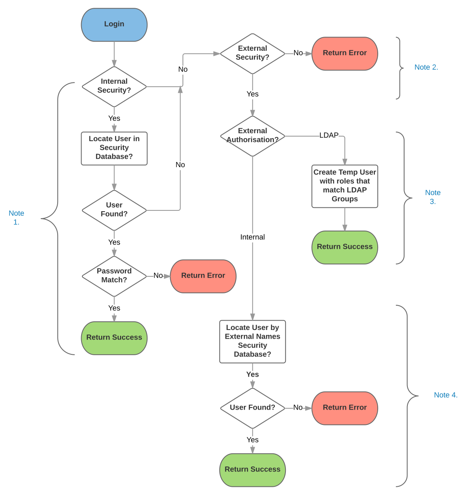
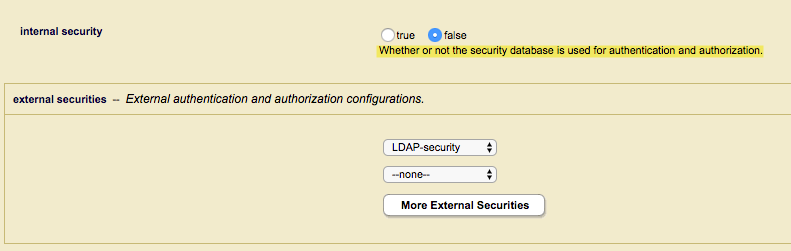
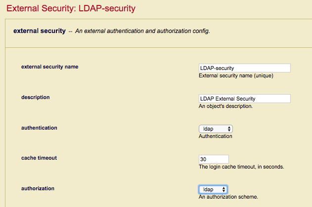

## Troubleshooting MarkLogic External Security (LDAP and Active Directory)

## Introduction

MarkLogic allows you to configure MarkLogic Server so that users are authenticated and authorised using an external authentication protocol, such as Lightweight Directory Access Protocol (LDAP) or Kerberos. These external agents serve as centralized points of authentication or repositories for user information from which authorization decisions can be made.

This article will attempt to give some guidance on how to troubleshoot those connection issues that occur after you have configured MarkLogic server for External Security using LDAP or Active Directory. As far as possible I will avoid repeating what is already in the MarkLogic documentation and to that end I would highly recommend that you make yourself familar with the following online documentation.
 
 * [MarkLogic Authentication](https://docs.marklogic.com/guide/security/authentication)
 * [MarkLogic External Authentication](https://docs.marklogic.com/guide/security/external-auth)
 
 
 Rather I will be looking more in depth at how MarkLogic works under the covers with regards External Security, what it is doing when it communicates with an LDAP or Active Directory server and some useful tools that will hopefully help you diagnose what exactly is going wrong.
 
 MarkLogic provides for a varied array of external security methods as described below and I hope to cover them all within this article, however if there is something specific that is not covered please let me know and I will do my best to make the neccessary updates.
 
 * External LDAP Users mapped to internal users
 * External LDAP users mapped to internal roles using temporary userids.
 * Certificate based authentication mapping X509 Common Name to internal users.
 * Certificate based authentication mapping X509 Distinguished Name to internal Users.
 * Certificate based authentication mapping X509 Distinguished Name to internal roles.
 * Mixed Internal and External Authentication.
 
 **Note:** Certificate based authentication methods are only available in [MarkLogic 9](https://docs.marklogic.com/guide/security/authentication#id_28959)
 
## Useful Tools
 
 Although this section is titled useful tools, I'd go so far as to say the following are essential tools if you are serious about diagnosing LDAP and Active Directory issues when attempting to use MarkLogic External Security. If you don't have personal experience with these tools it's well worth having someone around who does. I shall also try to include working examples along the way which will hopefully show how each utility is used.
  
  **ldapsearch** (Unix) and **ldp** (Windows) are LDAP clients which are usually when checking to see if your LDAP server is behaving as expected and returning the information needed. They can also be used to evaluate if authentication credentials and method used by MarkLogic will work with your particular LDAP server. **Apache Directory Studio** is platform independent  Java GUI LDAP client, it's very useful for seeing a pictorial tree view of LDAP Server layout. Apache DS also has the ability for running a local LDAP server which can be used for testing MarkLogic External Security without the need for access to a production LDAP server.
  
  **Wireshark** is a great networking tool that can not only be used to check if there are any connectivity issues between MarkLogic and the LDAP server but also allows low-level protocol analysis on the actual LDAP Requests and Response that are being sent back and forth between MarkLogic and the LDAP server.
  
  The MarkLogic **QConsole** is also useful during problem diagnosis to check that the MarkLogic server is able to process the results that an LDAP Search may respond with. It can also be used to check that settings used for an External Security definition are valid and do not contain errors.
   
 * [ldapsearch](https://linux.die.net/man/1/ldapsearch) 
 * [ldp](https://technet.microsoft.com/en-us/library/cc772839(v=ws.10).aspx) 
 * [Apache Directory Studio](http://directory.apache.org/studio/)
 * [Wireshark](https://www.wireshark.org/)
 * [QConsole](https://docs.marklogic.com/guide/qconsole/intro)

 
## First Principles
 
 Before getting started it is really important to understand how the MarkLogic External Security logic flow works to help dispell any preconceived misconceptions early on. Many products use LDAP or Active Directory to control access and not all follow the same way of working, a good understanding of the MarkLogic External Security logic flow is therefore essential when diagnosing access problems.
  
 The diagram below, while appearing to be complex at first glance is actually straight forward if you break it down into the four separate phases.
 
  
 
 
1.  The first step looks fairly innocuous but still catches out a number of people, what MarkLogic is doing at this point is simply determining whether the Internal Security database will be used to determine access and authorisation. 

  
  
  When Internal Security is enabled MarkLogic will always attempt to locate the connecting user in the Security Database if the user is not found and an External Security profile is defined (mixed authentication) MarkLogic will then proceed to attempt to authenticate the user against the defined LDAP server. If the user is found in the Security database, MarkLogic will verify the supplied password and grant access accordingly. A common misconception is the assumption that if the user is found in the Security database but authentication fails MarkLogic will then attempt to authenticate the user externally. This is not the case and is a particular import point to consider when using mixed authentication in that any external users **should not** have matching entries in the Security database. 

2. The second step is where MarkLogic decides whether to use External Security or not and as can be seen from the flow diagram it is reached by two conditional steps:

* If Internal Security is set to false in the App Server.
* If internal Security is enabled but the user is not found in the Security database.

At this point if an External Security profile is defined MarkLogic will proceed, otherwise access is rejected.

3. For the third step, MarkLogic determines how the Roles (Authorisation) will be derived. If "LDAP" authorisation is selected MarkLogic will create a temporary userid and assign Roles based on matching the users LDAP group membership to external names assigned to MarkLogic roles. Using LDAP for both authentication and authorisation allows an organization to maintain the MarkLogic users and roles completely independently of the MarkLogic Security database.

  
  
4. The forth and final step is reached when LDAP is used to authenticate the user but authorisation is performed internally. MarkLogic will attempt to map the full distinguished name (User DN) of the external LDAP to the external name of a internal user in the MarkLogic Security database, an entry is found the user will inheirt the roles assigned internally otherwise access is denied.

  

Hopefully, this has given you a better idea of how the basic principles of MarkLogic Authentication and Authorisation work and will make things a little easier when working through the various scenarios that follow.
 

