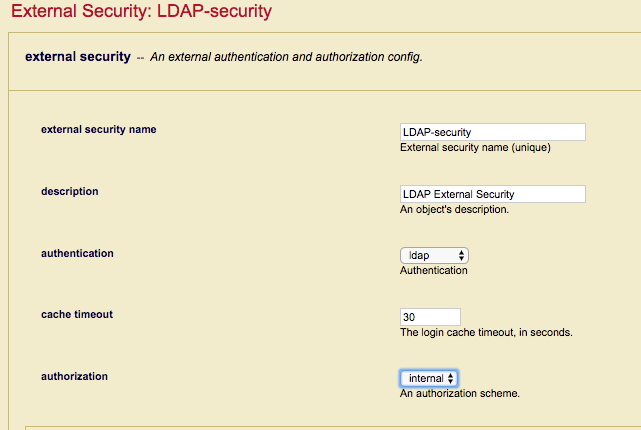
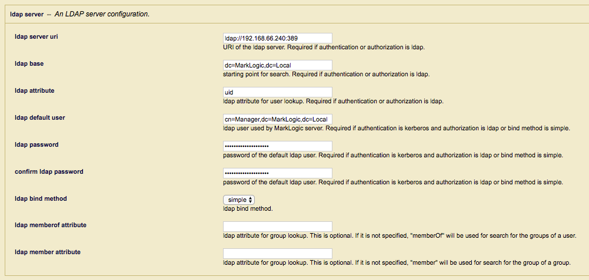
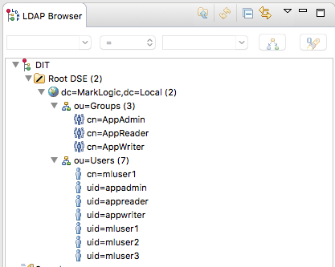
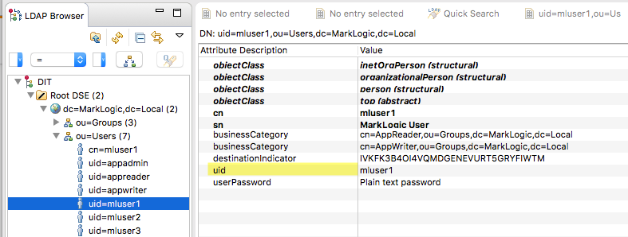

## Troubleshooting MarkLogic External Security (LDAP and Active Directory)

## Introduction

MarkLogic allows you to configure MarkLogic Server so that users are authenticated and authorised using an external authentication protocol, such as Lightweight Directory Access Protocol (LDAP) or Kerberos. These external agents serve as centralized points of authentication or repositories for user information from which authorization decisions can be made.

This article will attempt to give some guidance on how to troubleshoot those connection issues that occur after you have configured MarkLogic server for External Security using LDAP or Active Directory. As far as possible I will avoid repeating what is already in the MarkLogic documentation and to that end I would highly recommend that you make yourself familar with the following online documentation.
 
 * [MarkLogic Authentication](https://docs.marklogic.com/guide/security/authentication)
 * [MarkLogic External Authentication](https://docs.marklogic.com/guide/security/external-auth)
 
 
 Rather I will be looking more in depth at how MarkLogic works under the covers with regards External Security, what it is doing when it communicates with an LDAP or Active Directory server and some useful tools that will hopefully help you diagnose what exactly is going wrong.
 
 MarkLogic provides for a varied array of external security methods as described below and I hope to cover them all within this article, however if there is something specific that is not covered please let me know and I will do my best to make the neccessary updates.
 
 * External LDAP Users mapped to internal users
 * External LDAP users mapped to internal roles using temporary userids.
 * Certificate based authentication mapping X509 Common Name to internal users.
 * Certificate based authentication mapping X509 Distinguished Name to internal Users.
 * Certificate based authentication mapping X509 Distinguished Name to internal roles.
 * Mixed Internal and External Authentication.
 
 **Note:** Certificate based authentication methods are only available in [MarkLogic 9](https://docs.marklogic.com/guide/security/authentication#id_28959)
 
## Useful Tools
 
 Although this section is titled useful tools, I'd go so far as to say the following are essential tools if you are serious about diagnosing LDAP and Active Directory issues when attempting to use MarkLogic External Security. If you don't have personal experience with these tools it's well worth having someone around who does. I shall also try to include working examples along the way which will hopefully show how each utility is used.
  
  **ldapsearch** (Unix) and **ldp** (Windows) are LDAP clients which are usually when checking to see if your LDAP server is behaving as expected and returning the information needed. They can also be used to evaluate if authentication credentials and method used by MarkLogic will work with your particular LDAP server. **Apache Directory Studio** is platform independent  Java GUI LDAP client, it's very useful for seeing a pictorial tree view of LDAP Server layout. Apache DS also has the ability for running a local LDAP server which can be used for testing MarkLogic External Security without the need for access to a production LDAP server.
  
  **Wireshark** is a great networking tool that can not only be used to check if there are any connectivity issues between MarkLogic and the LDAP server but also allows low-level protocol analysis on the actual LDAP Requests and Response that are being sent back and forth between MarkLogic and the LDAP server.
  
  The MarkLogic **QConsole** is also useful during problem diagnosis to check that the MarkLogic server is able to process the results that an LDAP Search may respond with. It can also be used to check that settings used for an External Security definition are valid and do not contain errors.
   
 * [ldapsearch](https://linux.die.net/man/1/ldapsearch) 
 * [ldp](https://technet.microsoft.com/en-us/library/cc772839(v=ws.10).aspx) 
 * [Apache Directory Studio](http://directory.apache.org/studio/)
 * [Wireshark](https://www.wireshark.org/)
 * [QConsole](https://docs.marklogic.com/guide/qconsole/intro)

 
## First Principles
 
 Before getting started it is really important to understand how the MarkLogic External Security logic flow works to help dispell any preconceived misconceptions early on. Many products use LDAP or Active Directory to control access and not all follow the same way of working, a good understanding of the MarkLogic External Security logic flow is therefore essential when diagnosing access problems.
  
 The diagram below, while appearing to be complex at first glance is actually straight forward if you break it down into the four separate phases.
 
  
  
1.  The first step looks fairly innocuous but still catches out a number of people, what MarkLogic is doing at this point is simply determining whether the Internal Security database will be used to determine access and authorisation. 

    
  
    When Internal Security is enabled MarkLogic will always attempt to locate the connecting user in the Security Database if the user is not found and an External Security profile is defined (mixed authentication) MarkLogic will then proceed to attempt to authenticate the user against the defined LDAP server. If the user is found in the Security database, MarkLogic will verify the supplied password and grant access accordingly. A common misconception is the assumption that if the user is found in the Security database but authentication fails MarkLogic will then attempt to authenticate the user externally. This is not the case and is a particular import point to consider when using mixed authentication in that any external users **should not** have matching entries in the Security database. 

2. The second step is where MarkLogic decides whether to use External Security or not and as can be seen from the flow diagram it is reached by two conditional steps:

    * If Internal Security is set to false in the App Server.
    * If internal Security is enabled but the user is not found in the Security database.

    At this point if an External Security profile is defined MarkLogic will proceed, otherwise access is rejected.

3. For the third step, MarkLogic determines how the Roles (Authorisation) will be derived. If "LDAP" authorisation is selected MarkLogic will create a temporary userid and assign Roles based on matching the users LDAP group membership to external names assigned to MarkLogic roles. Using LDAP for both authentication and authorisation allows an organization to maintain the MarkLogic users and roles completely independently of the MarkLogic Security database.

    
  
4. The forth and final step is reached when LDAP is used to authenticate the user but authorisation is performed internally. MarkLogic will attempt to map the full distinguished name (User DN) of the external LDAP to the external name of a internal user in the MarkLogic Security database, an entry is found the user will inheirt the roles assigned internally otherwise access is denied.

    

Hopefully, this has given you a better idea of how the basic principles of MarkLogic Authentication and Authorisation work and will make things a little easier when working through the various scenarios that follow.
 

## External Security LDAP Server configuration

Whether you are using LDAP for authentication or authentication and authorisation the primary configuration point is the LDAP Server definition. Ensuring the LDAP server configuration is valid is key and will save much time and frustration down the line if make sure it is working as expected up front.

   

Before we check that the configuration is working it's worth reviewing each parameter to understand which it is and the role it takes in the external security process.

* <b>ldap server uri</b>As the comment in the UI states this is the URI of the LDAP server that MarkLogic will connect to and is of the format `<protocol>://<host>:<port>`, where protocol can be either __ldap__ or __ldaps__, host is either a hostname or IP Address and port is the LDAP listening port.
    If the port is not specified then the default port 389 will be used if LDAP is specified and port 636 if LDAPS is used.

    The following are example of valid and invalid ldap server uri's

    __valid__
* ldap://192.168.0.50:389
* ldaps://marklogic.com

    __invalid__
* ~~192.168.40.222:389~~
* ~~ldap.server.com~~

    Note: when using **ldaps** you will need to import the required LDAP server CA Certificates into the MarkLogic Trusted certificate store.

 
* <b>ldap base</b>This parameter defines where in the LDAP Directory tree the search for a user and group membership will take place. You should ensure that you select a base Distinguished Name (DN) that will return the correct information that MarkLogic needs to complete authentication and/or authorisation.
                                       
    For example, the Apache Directory Studio (ApacheDS) display below of a simple LDAP server shows entries for Users where the DN is __"ou=Users,dc=MarkLogic,dc=Local"__ and Groups with a DN of __"ou=Groups,dc=MarkLogic,dc=Local"__. If only LDAP authentication is required than setting the LDAP base to __"ou=Users,dc=MarkLogic,dc=Local"__ would be sufficient as all the users are contained within that sub-tree, however if authorisation is also required to determine roll access then searches for group of group membership would not return any results as these are contain in a separate sub-tree. In this case selecting __"dc=MarkLogic,dc=Local"__ as the LDAP base DN would be a better choice as it contains sub-trees for both Users and Groups.

   
   
* <b>ldap attribute</b>The LDAP attribute is used as the filter during the LDAP Search performed by MarkLogic to locate the user directory entry, this is typically __"uid"__ for Unix based LDAP servers or __"sAMAccountName"__ if you are using Microsoft Windows Active Directory. 

    The following ApacheDS display shows a LDAP entry that hold the userid in the __"uid"__ attribute.

      
   
* <b>ldap default user</b>
* <b>ldap password</b>The LDAP default user is used by MarkLogic authenticate to the LDAP server and perform a search using Base DN and attribute defined above to locate the user's directory entry. If LDAP authorisation is also configured then an additional search is performed for any group of group memberships to be used during Role determination. While the description describes the user as being the "default" you should ensure that the user defined has sufficient permissions on the LDAP server to search the configured Base DN and return all attributes and values. I'll go into more detail on exactly watch searches are performed and which attributes are retrieved when looking at the individual configuration scenarios later in this article.

    The ldap default user value can either be an LDAP User DN such as __"cn=Manager,dc=MarkLogic,dc=Local"__ or if you are using an Active Directory server then a Domain user such as __"MARKLOGIC\Administrator"__ can be used instead.

    __Note:__ If you are using the __MD5__ bind method below then the LDAP default user and password are not required and MarkLogic will authenticate to the LDAP server using the supplied userid and a __DIGEST-MD5__ Bind instead.

* <b>ldap bind method</b>This parameter controls whether MarkLogic connects to LDAP or Active Directory server using the default user and a __"Simple"__ bind or the supplied userid and a __DIGEST_MD5__ bind.

    __Note:__ While MD5 is supported as a bind Method in MarkLogic I would highly recommend against using it for new configurations. DIGEST-MD5 is now considered insecure has been officially deprecated with [RFC6331](https://tools.ietf.org/html/rfc6331), if you are using MD5 for an existing configuration I would recommend moving to using the __"Simple"__ Bind method and the secure __LDAPS__ protocol instead.

* <b>ldap memberof attribute</b>
* <b>ldap member attribute</b>By default, MarkLogic uses the __"memberOf"__ and __"member"__ search filters to determine which Groups, and Group of Groups, a user belongs to for Role based authorisation. If your particular LDAP or Active Directory server uses a different attribute to store values such as __"isMemberOf"__ or __"groupMembership"__ then you can override the default values with these fields.

    <b>Note:</b> The __"memberOf"__ and __"member"__ attributes can only be overridden with MarkLogic 9 and later.

## Verifying the LDAP Server configuration

Before proceeding to complete the external security configuration it's worth ensuring that the settings are correct and MarkLogic is able to connect and retrieve the required information.

