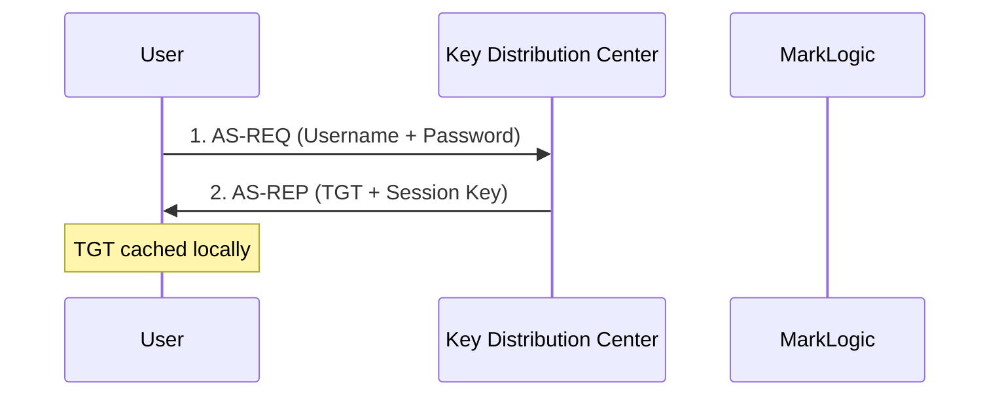
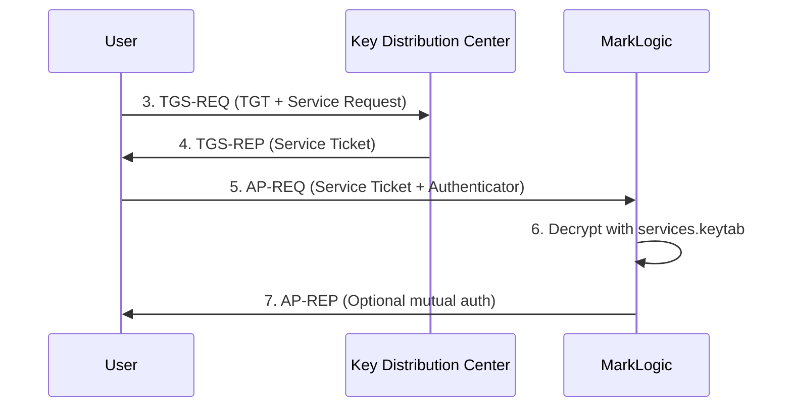

# 🎫 Kerberos Authentication Troubleshooting
## MarkLogic Service Principal and Ticket Validation

[](#)
[](https://docs.marklogic.com/)
[](#)

> **Comprehensive Kerberos troubleshooting for MarkLogic single sign-on**
>
> Master service principal configuration, keytab management, and ticket validation

---

## 📋 Table of Contents

- [Introduction](#-introduction)
- [Kerberos Fundamentals](#-kerberos-fundamentals)
- [MarkLogic Kerberos Configuration](#-marklogic-kerberos-configuration)
- [Service Keytab Management](#-service-keytab-management)
- [User Ticket Validation](#-user-ticket-validation)
- [Active Directory Integration](#-active-directory-integration)
- [Troubleshooting Tools](#-troubleshooting-tools)
- [Common Issues](#-common-issues)
- [Security Best Practices](#-security-best-practices)
- [Performance and Monitoring](#-performance-and-monitoring)

---

## 🎯 Introduction

Kerberos provides secure, single sign-on authentication for MarkLogic using domain credentials. This guide covers comprehensive troubleshooting for Kerberos configuration, focusing on the critical `services.keytab` file and user ticket validation.

### 🔧 Why Kerberos Matters

Kerberos authentication provides:
- **Single Sign-On** - Users authenticate once to domain
- **Mutual Authentication** - Both client and server verify identity
- **No Password Transmission** - Tickets used instead of passwords
- **Domain Integration** - Seamless Active Directory integration
- **Enterprise Security** - Industry-standard authentication protocol

### 🎯 Kerberos vs Other Authentication Methods

| Feature | Kerberos | LDAP | SAML 2.0 | OAuth 2.0 |
|---------|----------|------|----------|-----------|
| **Single Sign-On** | ✅ Native | ❌ No | ✅ Yes | ⚠️ Limited |
| **Domain Integration** | ✅ Excellent | ✅ Good | ⚠️ Limited | ❌ No |
| **No Password Transmission** | ✅ Tickets | ❌ Passwords | ✅ Tokens | ✅ Tokens |
| **Mutual Authentication** | ✅ Yes | ❌ No | ⚠️ Limited | ❌ No |
| **Offline Capability** | ✅ Cached Tickets | ❌ No | ❌ No | ❌ No |
| **Complexity** | 🔶 High | 🟢 Low | 🔶 High | 🟡 Medium |

---

## 📚 Kerberos Fundamentals

### 🏗️ **Core Components**

#### **Key Distribution Center (KDC)**
Central authentication server that issues tickets.

**Components:**
- **Authentication Server (AS)** - Initial user authentication
- **Ticket Granting Server (TGS)** - Service ticket distribution
- **Principal Database** - User and service accounts

#### **Service Principal Name (SPN)**
Unique identifier for services in Kerberos realm.

**MarkLogic SPN Format:**
```
HTTP/marklogic.example.com@EXAMPLE.COM
HTTP/marklogic.example.com:8000@EXAMPLE.COM
```

#### **Keytab File**
Contains encrypted keys for service principals.

**MarkLogic Requirements:**
- **Filename**: Must be named `services.keytab`
- **Location**: Root of MarkLogic installation directory
- **Permissions**: Readable by MarkLogic process only
- **Content**: Service principal credentials for ticket decryption

### 🔄 **Kerberos Authentication Flow**

#### **Initial Authentication (AS-REQ/AS-REP)**


#### **Service Authentication (TGS-REQ/TGS-REP)**


### 📝 **Key Kerberos Concepts**

#### **Ticket Granting Ticket (TGT)**
Initial authentication ticket for requesting service tickets.

**Characteristics:**
- **Lifetime**: 8-10 hours (configurable)
- **Renewable**: Can be renewed before expiration
- **Cached**: Stored in user's credential cache
- **Scope**: Valid for entire Kerberos realm

#### **Service Ticket**
Specific ticket for accessing individual services.

**Characteristics:**
- **Lifetime**: 5-10 hours (configurable)
- **Service-Specific**: Valid only for target service
- **Encrypted**: Using service's secret key
- **Single-Use**: Generally not reusable

#### **Principal Names**
Unique identifiers in Kerberos realm.

**User Principal**: `user@EXAMPLE.COM`
**Service Principal**: `HTTP/server.example.com@EXAMPLE.COM`

---

## 🏗️ MarkLogic Kerberos Configuration

### 📋 **External Security Configuration**

#### **Basic Kerberos Setup**
```xquery
(: Create Kerberos external security configuration :)
import module namespace sec = "http://marklogic.com/xdmp/security" 
  at "/MarkLogic/security.xqy";

sec:create-external-security(
  "kerberos-config",
  "Kerberos Domain Authentication",
  "kerberos5",
  map:new((
    map:entry("authentication", "kerberos5"),
    map:entry("cache-timeout", 600),
    map:entry("authorization", "internal"),
    map:entry("ldap-server-uri", "ldap://dc.example.com:389"),
    map:entry("ldap-base", "dc=example,dc=com"),
    map:entry("ldap-attribute", "sAMAccountName"),
    map:entry("ldap-default-user", "cn=MarkLogic Service,ou=Service Accounts,dc=example,dc=com")
  ))
)
```

#### **Kerberos External Security Options**

| Parameter | Description | Example | Required |
|-----------|-------------|---------|----------|
| **authentication** | Authentication method | `"kerberos5"` | ✅ Yes |
| **authorization** | Authorization source | `"internal"` or `"ldap"` | ✅ Yes |
| **cache-timeout** | Credential cache duration (seconds) | `600` | ❌ Optional |
| **ldap-server-uri** | LDAP server for user lookup | `"ldap://dc.example.com:389"` | ⚠️ If authorization=ldap |
| **ldap-base** | LDAP search base | `"dc=example,dc=com"` | ⚠️ If authorization=ldap |
| **ldap-attribute** | Username attribute | `"sAMAccountName"` | ⚠️ If authorization=ldap |
| **ldap-default-user** | Fallback user for lookups | Service account DN | ❌ Optional |

### 🌐 **App Server Configuration**

#### **Configure Kerberos Authentication**
```xquery
(: Configure App Server for Kerberos authentication :)
import module namespace admin = "http://marklogic.com/xdmp/admin" 
  at "/MarkLogic/admin.xqy";

let $config := admin:get-configuration()
let $appserver-id := admin:appserver-get-id($config, 
  admin:group-get-id($config, "Default"), "App-Services")

(: Set authentication to Kerberos external security :)
let $config := admin:appserver-set-authentication($config, 
  $appserver-id, "external-security")
let $config := admin:appserver-set-external-security($config, 
  $appserver-id, "kerberos-config")

return admin:save-configuration($config)
```

#### **Kerberos Realm Configuration**
```bash
# System-level Kerberos configuration (/etc/krb5.conf)
[libdefaults]
    default_realm = EXAMPLE.COM
    dns_lookup_realm = true
    dns_lookup_kdc = true
    ticket_lifetime = 8h
    renew_lifetime = 7d
    forwardable = true

[realms]
    EXAMPLE.COM = {
        kdc = dc1.example.com:88
        kdc = dc2.example.com:88
        admin_server = dc1.example.com:749
        default_domain = example.com
    }

[domain_realm]
    .example.com = EXAMPLE.COM
    example.com = EXAMPLE.COM
```

---

## 🔐 Service Keytab Management

### 📁 **Critical Keytab Requirements**

#### **Mandatory Configuration**
- **Filename**: Must be exactly `services.keytab`
- **Location**: Root of MarkLogic installation directory
- **Path Examples**:
  - `/opt/MarkLogic/services.keytab` (Linux)
  - `C:\Program Files\MarkLogic\services.keytab` (Windows)

#### **File Permissions**
```bash
# Linux/Unix permissions
chown marklogic:marklogic /opt/MarkLogic/services.keytab
chmod 600 /opt/MarkLogic/services.keytab

# Verify permissions
ls -la /opt/MarkLogic/services.keytab
# Should show: -rw------- 1 marklogic marklogic
```

### 🔧 **Keytab Generation**

#### **Active Directory Service Account Setup**
1. **Create Service Account**
   ```powershell
   # Create MarkLogic service account
   New-ADUser -Name "MarkLogicSvc" -UserPrincipalName "marklogicsvc@example.com" -SamAccountName "marklogicsvc" -AccountPassword (ConvertTo-SecureString "ComplexPassword123!" -AsPlainText -Force) -Enabled $true
   
   # Set password to never expire
   Set-ADUser -Identity "marklogicsvc" -PasswordNeverExpires $true
   ```

2. **Register Service Principal Names**
   ```cmd
   REM Register SPNs for MarkLogic service
   setspn -A HTTP/marklogic.example.com EXAMPLE\marklogicsvc
   setspn -A HTTP/marklogic.example.com:8000 EXAMPLE\marklogicsvc
   setspn -A HTTP/marklogic.example.com:8001 EXAMPLE\marklogicsvc
   
   REM Verify SPN registration
   setspn -L EXAMPLE\marklogicsvc
   ```

3. **Generate Keytab File**
   ```cmd
   REM Generate keytab using ktpass
   ktpass -princ HTTP/marklogic.example.com@EXAMPLE.COM -mapuser EXAMPLE\marklogicsvc -crypto AES256-SHA1 -ptype KRB5_NT_PRINCIPAL -pass ComplexPassword123! -out services.keytab
   
   REM Add additional SPNs to same keytab
   ktpass -princ HTTP/marklogic.example.com:8000@EXAMPLE.COM -mapuser EXAMPLE\marklogicsvc -crypto AES256-SHA1 -ptype KRB5_NT_PRINCIPAL -pass ComplexPassword123! -in services.keytab -out services.keytab
   ```

#### **MIT Kerberos Keytab Generation**
```bash
# Using kadmin to generate keytab
kadmin -p admin/admin@EXAMPLE.COM

# In kadmin prompt:
addprinc -randkey HTTP/marklogic.example.com@EXAMPLE.COM
addprinc -randkey HTTP/marklogic.example.com:8000@EXAMPLE.COM
ktadd -k /opt/MarkLogic/services.keytab HTTP/marklogic.example.com@EXAMPLE.COM
ktadd -k /opt/MarkLogic/services.keytab HTTP/marklogic.example.com:8000@EXAMPLE.COM
quit
```

### 🔍 **Keytab Validation**

#### **List Keytab Contents**
```bash
# List principals in keytab
klist -kt /opt/MarkLogic/services.keytab

# Expected output:
# Keytab name: FILE:/opt/MarkLogic/services.keytab
# KVNO Timestamp         Principal
# ---- ----------------- --------------------------------------------------------
#    5 10/15/2025 14:30:22 HTTP/marklogic.example.com@EXAMPLE.COM (aes256-cts-hmac-sha1-96)
#    5 10/15/2025 14:30:22 HTTP/marklogic.example.com:8000@EXAMPLE.COM (aes256-cts-hmac-sha1-96)
```

#### **Test Keytab Authentication**
```bash
# Test keytab can obtain service tickets
kinit -kt /opt/MarkLogic/services.keytab HTTP/marklogic.example.com@EXAMPLE.COM

# Verify ticket cache
klist
# Should show valid service principal credentials

# Clean up test tickets
kdestroy
```

#### **Keytab Health Check Script**
```bash
#!/bin/bash
# Keytab validation script

KEYTAB_PATH="/opt/MarkLogic/services.keytab"
EXPECTED_PRINCIPAL="HTTP/$(hostname -f)@$(hostname -d | tr '[:lower:]' '[:upper:]')"

echo "🔍 MarkLogic Keytab Health Check"
echo "=================================="

# Check file exists
if [ ! -f "$KEYTAB_PATH" ]; then
    echo "❌ ERROR: services.keytab not found at $KEYTAB_PATH"
    exit 1
fi

# Check file permissions
PERMS=$(stat -c %a "$KEYTAB_PATH" 2>/dev/null || stat -f %A "$KEYTAB_PATH")
if [ "$PERMS" != "600" ]; then
    echo "⚠️  WARNING: Incorrect permissions ($PERMS), should be 600"
fi

# Check file ownership (Linux)
if [ "$(uname)" = "Linux" ]; then
    OWNER=$(stat -c %U "$KEYTAB_PATH")
    if [ "$OWNER" != "marklogic" ]; then
        echo "⚠️  WARNING: Incorrect owner ($OWNER), should be marklogic"
    fi
fi

# List keytab contents
echo -e "\n📋 Keytab Contents:"
klist -kt "$KEYTAB_PATH"

# Test authentication
echo -e "\n🔐 Testing Authentication:"
if kinit -kt "$KEYTAB_PATH" "$EXPECTED_PRINCIPAL" 2>/dev/null; then
    echo "✅ Authentication successful"
    kdestroy
else
    echo "❌ Authentication failed"
fi

echo -e "\n✅ Health check completed"
```

---

## 🎫 User Ticket Validation

### 🔍 **Common Ticket Issues**

#### **User Ticket Generation Problems**

**Symptoms:**
- Users cannot authenticate to MarkLogic
- "Authentication failed" errors
- No Kerberos tickets in user cache

**Root Causes:**
1. **No Initial Authentication** - User hasn't obtained TGT
2. **Expired Tickets** - TGT or service tickets expired
3. **Clock Skew** - Time difference between client and KDC
4. **Network Issues** - Cannot reach KDC
5. **Wrong Realm** - Client configured for different realm

#### **Ticket Validation Process**

**Client-Side Diagnostics:**
```bash
# Check current ticket cache
klist

# Expected output for authenticated user:
# Ticket cache: FILE:/tmp/krb5cc_1001
# Default principal: user@EXAMPLE.COM
# 
# Valid starting       Expires              Service principal
# 10/15/2025 09:00:00  10/15/2025 17:00:00  krbtgt/EXAMPLE.COM@EXAMPLE.COM
# 10/15/2025 09:15:00  10/15/2025 17:00:00  HTTP/marklogic.example.com@EXAMPLE.COM

# Manual ticket acquisition
kinit user@EXAMPLE.COM
# Enter password when prompted

# Request service ticket
kvno HTTP/marklogic.example.com@EXAMPLE.COM
```

### 🌐 **Browser Integration**

#### **Internet Explorer/Edge Configuration**
1. **Add MarkLogic to Trusted Sites**
   - Internet Options → Security → Trusted Sites
   - Add: `https://marklogic.example.com`

2. **Enable Integrated Authentication**
   - Internet Options → Advanced → Security
   - ✅ Enable Integrated Windows Authentication

3. **Configure Automatic Logon**
   - Internet Options → Security → Trusted Sites → Custom Level
   - User Authentication → Logon → Automatic logon only in Intranet zone

#### **Chrome Configuration**
```bash
# Add trusted sites for Kerberos authentication
google-chrome --auth-server-whitelist="marklogic.example.com" --auth-negotiate-delegate-whitelist="marklogic.example.com"

# Or configure via policy (Windows)
# HKEY_LOCAL_MACHINE\SOFTWARE\Policies\Google\Chrome
# AuthServerWhitelist: marklogic.example.com
# AuthNegotiateDelegateWhitelist: marklogic.example.com
```

#### **Firefox Configuration**
```
# about:config settings
network.negotiate-auth.trusted-uris: marklogic.example.com
network.negotiate-auth.delegation-uris: marklogic.example.com
network.automatic-ntlm-auth.trusted-uris: marklogic.example.com
```

### 🔧 **Ticket Debugging Commands**

#### **Comprehensive Ticket Analysis**
```bash
#!/bin/bash
# User ticket diagnostics

USER_PRINCIPAL=$(whoami)@$(hostname -d | tr '[:lower:]' '[:upper:]')

echo "🎫 Kerberos Ticket Diagnostics"
echo "=============================="
echo "User: $USER_PRINCIPAL"
echo "Host: $(hostname -f)"
echo "Date: $(date)"

# Check for existing tickets
echo -e "\n📋 Current Ticket Cache:"
if klist 2>/dev/null; then
    echo "✅ Tickets found"
else
    echo "❌ No tickets in cache"
    echo "💡 Try: kinit $USER_PRINCIPAL"
fi

# Test KDC connectivity
echo -e "\n🌐 KDC Connectivity:"
for kdc in dc1.example.com dc2.example.com; do
    if nc -z $kdc 88 2>/dev/null; then
        echo "✅ $kdc:88 reachable"
    else
        echo "❌ $kdc:88 unreachable"
    fi
done

# Check time synchronization
echo -e "\n⏰ Time Synchronization:"
LOCAL_TIME=$(date +%s)
# Compare with domain controller time (requires additional tools)
echo "Local time: $(date)"
echo "💡 Ensure NTP sync with domain controllers"

# Test service ticket acquisition
echo -e "\n🎯 Service Ticket Test:"
if kvno HTTP/marklogic.example.com@EXAMPLE.COM 2>/dev/null; then
    echo "✅ Service ticket obtained"
else
    echo "❌ Failed to get service ticket"
    echo "💡 Check SPN registration and keytab"
fi
```

---

## 🏢 Active Directory Integration

### 🔧 **Domain Controller Configuration**

#### **Service Account Best Practices**
```powershell
# Create dedicated MarkLogic service account
$Password = ConvertTo-SecureString "YourComplexPassword123!" -AsPlainText -Force
New-ADUser -Name "MarkLogicService" `
           -SamAccountName "mlsvc" `
           -UserPrincipalName "mlsvc@example.com" `
           -DisplayName "MarkLogic Service Account" `
           -Description "Service account for MarkLogic Kerberos authentication" `
           -AccountPassword $Password `
           -PasswordNeverExpires $true `
           -CannotChangePassword $true `
           -Enabled $true

# Set account for service use
Set-ADUser -Identity "mlsvc" -TrustedForDelegation $false
Set-ADUser -Identity "mlsvc" -AccountNotDelegated $true
```

#### **Service Principal Name Management**
```powershell
# Register all required SPNs
$ServiceAccount = "EXAMPLE\mlsvc"
$Hostnames = @(
    "marklogic.example.com",
    "marklogic",
    "192.168.1.100"  # If using IP addresses
)
$Ports = @("8000", "8001", "8002")  # MarkLogic ports

foreach ($hostname in $Hostnames) {
    # Register base HTTP SPN
    setspn -A "HTTP/$hostname" $ServiceAccount
    
    # Register port-specific SPNs
    foreach ($port in $Ports) {
        setspn -A "HTTP/$hostname`:$port" $ServiceAccount
    }
}

# Verify all SPNs
setspn -L $ServiceAccount
```

### 🔍 **Domain Troubleshooting**

#### **SPN Duplicate Detection**
```cmd
REM Check for duplicate SPNs
setspn -X

REM Search for specific SPN conflicts
setspn -Q HTTP/marklogic.example.com
```

#### **Account Status Validation**
```powershell
# Check service account status
Get-ADUser -Identity "mlsvc" -Properties AccountLockoutTime, BadLogonCount, LastLogonDate, PasswordExpired, PasswordLastSet

# Check account authentication
Test-ADAuthentication -Username "mlsvc" -Password "YourComplexPassword123!"
```

### 🔐 **Trust Relationships**

#### **Multi-Domain Scenarios**
```bash
# Configure cross-realm authentication in /etc/krb5.conf
[capaths]
    CHILD.EXAMPLE.COM = {
        PARENT.EXAMPLE.COM = .
    }
    PARENT.EXAMPLE.COM = {
        CHILD.EXAMPLE.COM = .
    }

[domain_realm]
    .child.example.com = CHILD.EXAMPLE.COM
    .parent.example.com = PARENT.EXAMPLE.COM
```

---

## 🔧 Troubleshooting Tools

### 🛠️ **Essential Kerberos Tools**

| Tool | Platform | Purpose | Skill Level |
|------|----------|---------|-------------|
| **klist** | Cross-platform | View ticket cache | Beginner |
| **kinit** | Cross-platform | Acquire tickets | Beginner |
| **kvno** | Cross-platform | Request service tickets | Intermediate |
| **ktutil** | Cross-platform | Keytab management | Intermediate |
| **setspn** | Windows | SPN management | Intermediate |
| **Wireshark** | Cross-platform | Network analysis ([Guide](../NETWORK_TROUBLESHOOTING.md)) | Advanced |

### 🔍 **Advanced Diagnostics**

#### **Kerberos Network Capture**
```bash
# Capture Kerberos traffic with tcpdump
tcpdump -i any -s 0 -w kerberos.pcap \
  '(port 88) or (port 464) or (tcp port 88) or (tcp port 464)'

# Filter for specific exchanges
tcpdump -i any -A 'port 88 and host dc1.example.com'
```

#### **Wireshark Kerberos Analysis**
```
# Wireshark display filters for Kerberos debugging
kerberos                           # All Kerberos traffic
kerberos.msg_type == 10           # AS-REQ (Authentication Request)
kerberos.msg_type == 11           # AS-REP (Authentication Reply)
kerberos.msg_type == 12           # TGS-REQ (Ticket Granting Request)
kerberos.msg_type == 13           # TGS-REP (Ticket Granting Reply)
kerberos.msg_type == 14           # AP-REQ (Application Request)
kerberos.msg_type == 15           # AP-REP (Application Reply)
kerberos.error_code != 0          # Kerberos errors only
```

#### **MarkLogic Kerberos Logging**
```xquery
(: Enable detailed Kerberos logging in MarkLogic :)
import module namespace admin = "http://marklogic.com/xdmp/admin" 
  at "/MarkLogic/admin.xqy";

let $config := admin:get-configuration()
let $group-id := admin:group-get-id($config, "Default")

(: Enable authentication event logging :)
let $config := admin:group-set-events-activated($config, $group-id, fn:true())
let $config := admin:group-set-audit-enabled($config, $group-id, fn:true())

return admin:save-configuration($config)
```

### 📊 **Monitoring Scripts**

#### **Keytab Monitoring Script**
```bash
#!/bin/bash
# Monitor keytab health and principal status

KEYTAB="/opt/MarkLogic/services.keytab"
LOG_FILE="/var/log/marklogic-kerberos.log"

log_message() {
    echo "$(date '+%Y-%m-%d %H:%M:%S') - $1" | tee -a "$LOG_FILE"
}

check_keytab_health() {
    log_message "🔍 Starting keytab health check"
    
    # Check file existence and permissions
    if [ ! -f "$KEYTAB" ]; then
        log_message "❌ CRITICAL: services.keytab not found"
        return 1
    fi
    
    # Check keytab can authenticate
    if ! kinit -kt "$KEYTAB" HTTP/$(hostname -f)@$(hostname -d | tr '[:lower:]' '[:upper:]') 2>/dev/null; then
        log_message "❌ ERROR: Keytab authentication failed"
        return 1
    fi
    
    kdestroy
    log_message "✅ Keytab health check passed"
    return 0
}

# Monitor service tickets
monitor_service_tickets() {
    log_message "📊 Monitoring service ticket requests"
    
    # Check for authentication failures in system logs
    FAILURES=$(grep -c "krb5_verify_checksum" /var/log/messages 2>/dev/null || echo "0")
    if [ "$FAILURES" -gt 0 ]; then
        log_message "⚠️  WARNING: $FAILURES Kerberos verification failures detected"
    fi
    
    # Check MarkLogic error logs for Kerberos issues
    ML_ERRORS=$(grep -c -i "kerberos\|authentication.*failed" /var/opt/MarkLogic/Logs/ErrorLog.txt 2>/dev/null || echo "0")
    if [ "$ML_ERRORS" -gt 0 ]; then
        log_message "⚠️  WARNING: $ML_ERRORS MarkLogic authentication errors detected"
    fi
}

# Run checks
check_keytab_health
monitor_service_tickets

log_message "🏁 Kerberos monitoring completed"
```

---

## ❌ Common Issues

### 🚨 **Keytab Configuration Problems**

#### **"services.keytab not found" Error**

**Symptoms:**
- MarkLogic logs show keytab file errors
- Authentication fails immediately
- No Kerberos tickets processed

**Root Causes:**
1. **Wrong filename** - File not named exactly `services.keytab`
2. **Wrong location** - Not in MarkLogic installation root
3. **Permission issues** - MarkLogic process cannot read file
4. **Missing file** - Keytab never created or deleted

**Diagnosis:**
```bash
# Check file location and name
find /opt/MarkLogic -name "*keytab*" -ls

# Verify exact path and permissions
ls -la /opt/MarkLogic/services.keytab

# Test MarkLogic can read file
sudo -u marklogic cat /opt/MarkLogic/services.keytab > /dev/null && echo "✅ Readable" || echo "❌ Not readable"
```

**Solution:**
```bash
# Ensure correct location and permissions
cp services.keytab /opt/MarkLogic/services.keytab
chown marklogic:marklogic /opt/MarkLogic/services.keytab
chmod 600 /opt/MarkLogic/services.keytab

# Restart MarkLogic to reload keytab
systemctl restart MarkLogic
```

#### **"Key version number mismatch" Error**

**Symptoms:**
- Authentication works initially then fails
- "Decrypt integrity check failed" in logs
- KDC returns KRB_AP_ERR_BADKEYVER

**Root Causes:**
1. **Password changed** - Service account password changed without updating keytab
2. **Key rotation** - Domain controller rotated keys
3. **Multiple keytabs** - Different systems have different key versions

**Diagnosis:**
```bash
# Check key version in keytab
klist -kt /opt/MarkLogic/services.keytab

# Check current KVNO in Active Directory  
kvno HTTP/marklogic.example.com@EXAMPLE.COM
```

**Solution:**
```cmd
REM Regenerate keytab with current password
ktpass -princ HTTP/marklogic.example.com@EXAMPLE.COM -mapuser EXAMPLE\mlsvc -crypto AES256-SHA1 -ptype KRB5_NT_PRINCIPAL -pass CurrentPassword -out services.keytab
```

### 🎫 **User Ticket Issues**

#### **"No credentials cache found" Error**

**Symptoms:**
- Users get authentication prompts
- Browser doesn't send Kerberos tickets
- Manual kinit required

**Root Causes:**
1. **No initial authentication** - User hasn't logged into domain
2. **Expired TGT** - Ticket Granting Ticket expired
3. **Browser configuration** - Browser not configured for Kerberos
4. **Zone configuration** - Site not in trusted zone

**Diagnosis:**
```bash
# Check user's ticket cache
klist

# Test manual authentication
kinit user@EXAMPLE.COM

# Verify browser configuration (Chrome)
google-chrome --auth-server-whitelist="marklogic.example.com"
```

**Solution:**
1. **Configure browsers** for automatic Kerberos authentication
2. **Add sites to trusted zones** in Internet Explorer/Edge
3. **Implement ticket refresh** in applications
4. **User training** on domain authentication

#### **"Clock skew too great" Error**

**Symptoms:**
- Authentication fails with time-related errors
- KRB_AP_ERR_SKEW in logs
- Intermittent authentication issues

**Root Causes:**
1. **Time synchronization** - Clocks differ by more than 5 minutes
2. **Timezone issues** - Incorrect timezone configuration
3. **NTP problems** - Time service not working

**Diagnosis:**
```bash
# Check local time
date

# Check time difference with domain controller
ntpdate -q dc1.example.com

# Check NTP synchronization status
ntpq -p
```

**Solution:**
```bash
# Synchronize with domain controllers
ntpdate dc1.example.com

# Configure automatic NTP sync
echo "server dc1.example.com" >> /etc/ntp.conf
systemctl enable ntp
systemctl start ntp
```

### 🌐 **Network and DNS Issues**

#### **"Cannot contact KDC" Error**

**Symptoms:**
- Authentication timeouts
- Cannot obtain tickets
- Network connectivity errors

**Root Causes:**
1. **Firewall blocking** - Ports 88 and 464 blocked
2. **DNS resolution** - Cannot resolve KDC names
3. **Network routing** - Cannot reach domain controllers

**Diagnosis:**
```bash
# Test KDC connectivity
nc -zv dc1.example.com 88
nc -zv dc1.example.com 464

# Test DNS resolution
nslookup _kerberos._tcp.example.com
dig SRV _kerberos._tcp.example.com

# Test basic network connectivity
ping dc1.example.com
```

**Solution:**
1. **Open firewall ports** 88 (TCP/UDP) and 464 (TCP/UDP)
2. **Configure DNS properly** with SRV records
3. **Verify network routing** to domain controllers

---

## 🔒 Security Best Practices

### 🛡️ **Keytab Security**

#### **Secure Keytab Management**
```bash
# ✅ Good: Secure keytab permissions
chown marklogic:marklogic /opt/MarkLogic/services.keytab
chmod 600 /opt/MarkLogic/services.keytab

# ❌ Bad: Insecure permissions
# chmod 644 /opt/MarkLogic/services.keytab  # Too permissive!

# Secure keytab backup
cp /opt/MarkLogic/services.keytab /secure/backup/location/
chmod 600 /secure/backup/location/services.keytab
```

#### **Service Account Hardening**
```powershell
# Service account security settings
Set-ADUser -Identity "mlsvc" -PasswordNeverExpires $true
Set-ADUser -Identity "mlsvc" -CannotChangePassword $true
Set-ADUser -Identity "mlsvc" -AccountNotDelegated $true
Set-ADUser -Identity "mlsvc" -TrustedForDelegation $false
Set-ADUser -Identity "mlsvc" -SmartcardLogonRequired $false

# Limit logon rights
# Add to "Log on as a service" right only
# Deny "Log on locally" and "Log on through Remote Desktop"
```

### 🔐 **Access Control**

#### **Principle of Least Privilege**
```xquery
(: Configure minimal required permissions :)
import module namespace sec = "http://marklogic.com/xdmp/security" 
  at "/MarkLogic/security.xqy";

(: Create role for Kerberos users :)
sec:create-role(
  "kerberos-users",
  "Standard role for Kerberos authenticated users",
  ("rest-reader", "rest-writer"),
  (),
  ()
),

(: Map Kerberos users to minimal role :)
sec:external-security-set-default-role("kerberos-config", "kerberos-users")
```

#### **Audit and Monitoring**
```xquery
(: Enable comprehensive Kerberos auditing :)
let $config := admin:get-configuration()
let $group-id := admin:group-get-id($config, "Default")

(: Enable authentication event logging :)
let $config := admin:group-set-audit-enabled($config, $group-id, fn:true())
let $config := admin:group-set-events-activated($config, $group-id, fn:true())

(: Log authentication successes and failures :)
let $events := ("authentication-success", "authentication-failure", "authorization-failure")
let $config := admin:group-set-audit-enabled-events($config, $group-id, $events)

return admin:save-configuration($config)
```

### 🔍 **Security Monitoring**

#### **Kerberos Security Monitoring**
```bash
#!/bin/bash
# Security monitoring for Kerberos infrastructure

ALERT_EMAIL="security@example.com"
LOG_FILE="/var/log/kerberos-security.log"

security_alert() {
    local message="$1"
    echo "$(date '+%Y-%m-%d %H:%M:%S') - SECURITY ALERT: $message" | tee -a "$LOG_FILE"
    echo "$message" | mail -s "Kerberos Security Alert" "$ALERT_EMAIL"
}

# Monitor authentication failures
check_auth_failures() {
    local failures=$(grep -c "authentication.*failed" /var/opt/MarkLogic/Logs/ErrorLog.txt)
    if [ "$failures" -gt 10 ]; then
        security_alert "High number of authentication failures detected: $failures"
    fi
}

# Monitor keytab access
check_keytab_access() {
    # Monitor file access to keytab
    if [ -f "/var/log/audit/audit.log" ]; then
        local suspicious_access=$(ausearch -f /opt/MarkLogic/services.keytab -ts today | grep -v "marklogic" | wc -l)
        if [ "$suspicious_access" -gt 0 ]; then
            security_alert "Suspicious keytab access detected"
        fi
    fi
}

# Monitor unusual ticket requests
check_unusual_tickets() {
    # Check for service tickets requested outside business hours
    local hour=$(date +%H)
    if [ "$hour" -lt 6 ] || [ "$hour" -gt 20 ]; then
        local ticket_requests=$(grep -c "TGS-REQ" /var/log/messages)
        if [ "$ticket_requests" -gt 5 ]; then
            security_alert "Unusual ticket activity outside business hours"
        fi
    fi
}

# Run security checks
check_auth_failures
check_keytab_access  
check_unusual_tickets
```

---

## ⚡ Performance and Monitoring

### 🚀 **Authentication Performance**

#### **Optimize Kerberos Caching**
```xquery
(: Configure optimal cache settings for Kerberos :)
import module namespace sec = "http://marklogic.com/xdmp/security" 
  at "/MarkLogic/security.xqy";

(: Balance security and performance :)
sec:external-security-set-cache-timeout("kerberos-config", 1800) (: 30 minutes :)
```

#### **Performance Guidelines**
| Environment | Cache Timeout | Rationale |
|-------------|---------------|-----------|
| **Development** | 300 seconds (5 min) | Faster credential changes |
| **Testing** | 900 seconds (15 min) | Balance testing and performance |
| **Production** | 1800 seconds (30 min) | Optimal performance |
| **High Security** | 600 seconds (10 min) | More frequent validation |

### 📊 **Monitoring and Metrics**

#### **Kerberos Performance Monitoring**
```xquery
(: Monitor Kerberos authentication performance :)
declare function local:measure-kerberos-performance() {
  let $start-time := xdmp:elapsed-time()
  
  (: Simulate Kerberos validation process :)
  let $external-security := sec:get-external-security("kerberos-config")
  let $validation-time := xdmp:elapsed-time() - $start-time
  
  return map:new((
    map:entry("kerberos_validation_time_ms", $validation-time div xs:dayTimeDuration("PT0.001S")),
    map:entry("cache_timeout", sec:external-security-get-cache-timeout($external-security)),
    map:entry("timestamp", fn:current-dateTime())
  ))
};

(: Log performance metrics :)
let $metrics := local:measure-kerberos-performance()
return xdmp:log($metrics, "info")
```

#### **Health Check Dashboard**
```bash
#!/bin/bash
# Kerberos health dashboard

echo "🎫 MarkLogic Kerberos Health Dashboard"
echo "====================================="
echo "Generated: $(date)"
echo ""

# System status
echo "📊 System Status:"
echo "  Host: $(hostname -f)"
echo "  Realm: $(hostname -d | tr '[:lower:]' '[:upper:]')"
echo "  OS: $(uname -sr)"
echo ""

# Keytab status
echo "🔐 Keytab Status:"
if [ -f "/opt/MarkLogic/services.keytab" ]; then
    echo "  ✅ File exists"
    echo "  📁 Size: $(stat -c%s /opt/MarkLogic/services.keytab) bytes"
    echo "  🔒 Permissions: $(stat -c%a /opt/MarkLogic/services.keytab)"
    echo "  📋 Principals: $(klist -kt /opt/MarkLogic/services.keytab 2>/dev/null | grep -c "HTTP/")"
else
    echo "  ❌ File missing"
fi
echo ""

# KDC connectivity
echo "🌐 KDC Connectivity:"
for kdc in dc1.example.com dc2.example.com; do
    if nc -z $kdc 88 2>/dev/null; then
        echo "  ✅ $kdc:88 reachable"
    else
        echo "  ❌ $kdc:88 unreachable"
    fi
done
echo ""

# Recent authentication activity
echo "📈 Recent Activity (last 24h):"
if [ -f "/var/opt/MarkLogic/Logs/ErrorLog.txt" ]; then
    SUCCESSES=$(grep -c "authentication.*success" /var/opt/MarkLogic/Logs/ErrorLog.txt 2>/dev/null || echo "0")
    FAILURES=$(grep -c "authentication.*failed" /var/opt/MarkLogic/Logs/ErrorLog.txt 2>/dev/null || echo "0")
    echo "  ✅ Successful authentications: $SUCCESSES"
    echo "  ❌ Failed authentications: $FAILURES"
else
    echo "  ⚠️  Log file not accessible"
fi

echo ""
echo "🏁 Dashboard complete"
```

---

## 📋 Summary

This comprehensive Kerberos troubleshooting guide provides everything needed to successfully implement and maintain Kerberos authentication with MarkLogic.

### 🎯 **Key Takeaways**

#### **Critical Requirements**
- **services.keytab** must be exactly named and located in MarkLogic installation root
- **Service Principal Names** must be properly registered in Active Directory
- **File permissions** must restrict access to MarkLogic process only
- **Time synchronization** is essential for ticket validation

#### **Common Failure Points**
- **Keytab location or permissions** - Most frequent configuration issue
- **User ticket generation** - Browser and client configuration problems
- **Clock skew** - Time synchronization between systems
- **Network connectivity** - Firewall and DNS resolution issues

#### **Best Practices**
- Regular keytab health monitoring
- Secure service account management
- Comprehensive audit logging
- Performance optimization through caching

### 🔧 **Essential Tools Mastery**
- **klist/kinit** for ticket management and debugging
- **setspn** for Service Principal Name administration
- **Wireshark** for network troubleshooting ([Complete Guide](../NETWORK_TROUBLESHOOTING.md))
- **OpenSSL** for certificate operations ([TLS Guide](../TLS_CERTIFICATE_MANAGEMENT.md))

### 📊 **Production Readiness**
- Automated health monitoring and alerting
- Security hardening and access control
- Performance monitoring and optimization
- Comprehensive documentation and procedures

Mastering Kerberos authentication enables seamless single sign-on integration with Active Directory while maintaining enterprise-grade security standards.