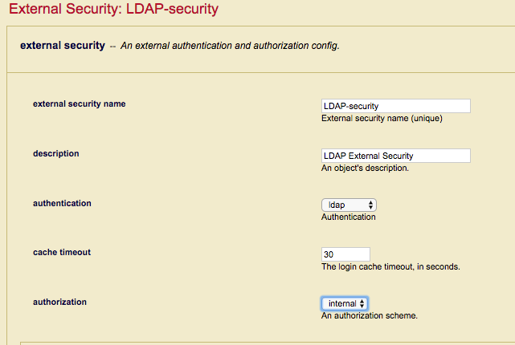
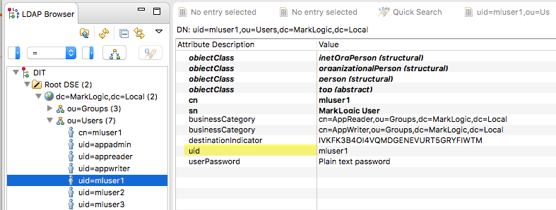

# 🔐 Troubleshooting MarkLogic External Security
## LDAP and Active Directory Authentication & Authorization

[](https://docs.marklogic.com/guide/security/external-auth)
[](#)
[](#)

> **A comprehensive troubleshooting guide for MarkLogic external authentication**
>
> Learn to diagnose and resolve LDAP and Active Directory integration issues

---

## 📋 Table of Contents

- [Introduction](#-introduction)
- [Essential Tools](#-essential-tools)
- [First Principles](#-first-principles)
- [LDAP Server Configuration](#-ldap-server-configuration)
- [Configuration Verification](#-configuration-verification)
- [Common Issues](#-common-issues)
- [Best Practices](#-best-practices)

---

## 🎯 Introduction

MarkLogic allows you to configure MarkLogic Server so that users are authenticated and authorized using an external authentication protocol, such as Lightweight Directory Access Protocol (LDAP) or Kerberos. These external agents serve as centralized points of authentication or repositories for user information from which authorization decisions can be made.

This article provides comprehensive guidance on troubleshooting connection issues that occur after configuring MarkLogic Server for External Security using LDAP or Active Directory. Rather than repeating existing documentation, this guide focuses on practical troubleshooting techniques and real-world scenarios.

### 📖 Prerequisites

Before proceeding, familiarize yourself with the official MarkLogic documentation:

- **[MarkLogic Authentication](https://docs.marklogic.com/guide/security/authentication)** - Core authentication concepts
- **[MarkLogic External Authentication](https://docs.marklogic.com/guide/security/external-auth)** - External security configuration

### 🎯 What This Guide Covers

This article examines how MarkLogic works internally with external security, analyzing the communication between MarkLogic and LDAP/Active Directory servers, and providing practical diagnostic tools and techniques.

### 🔐 Supported External Security Methods

MarkLogic provides several external security authentication methods:

| Method | Description | MarkLogic Version |
|--------|-------------|-------------------|
| **LDAP → Internal Users** | External LDAP users mapped to internal MarkLogic users | All versions |
| **LDAP → Internal Roles** | External LDAP users mapped to internal roles using temporary userids | All versions |
| **X.509 CN → Internal Users** | Certificate-based authentication mapping Common Name to internal users | MarkLogic 9+ |
| **X.509 DN → Internal Users** | Certificate-based authentication mapping Distinguished Name to internal users | MarkLogic 9+ |
| **X.509 DN → Internal Roles** | Certificate-based authentication mapping Distinguished Name to internal roles | MarkLogic 9+ |
| **Mixed Authentication** | Combination of internal and external authentication | All versions |

> **📝 Note**: Certificate-based authentication methods are only available in [MarkLogic 9+](https://docs.marklogic.com/guide/security/authentication#id_28959)
>
> 🔐 **Certificate Setup**: For creating and managing X.509 certificates, see our [TLS Certificate Management Guide](../TLS_CERTIFICATE_MANAGEMENT.md).
 
## 🛠️ Essential Tools

These tools are not merely useful—they are **essential** for serious LDAP and Active Directory troubleshooting with MarkLogic External Security. If you're not familiar with these tools, consider having an experienced colleague assist you.

### 📊 Tool Overview

| Tool | Platform | Purpose | Use Case |
|------|----------|---------|----------|
| **ldapsearch** | Unix/Linux | LDAP client testing | Verify LDAP server responses and authentication |
| **ldp** | Windows | LDAP client testing | Windows equivalent of ldapsearch |
| **Apache Directory Studio** | Cross-platform | LDAP browser/server | Visual LDAP tree exploration and local testing |
| **Wireshark** | Cross-platform | Network protocol analysis | Low-level LDAP traffic inspection |
| **QConsole** | MarkLogic | Query testing | Validate MarkLogic LDAP processing |

### 🔍 Detailed Tool Descriptions

#### **ldapsearch** (Unix/Linux)
Command-line LDAP client for testing server connectivity and data retrieval. Essential for validating that your LDAP server behaves as expected and returns the information MarkLogic needs.

**Key Features:**
- Test authentication credentials
- Verify search filters and base DNs
- Validate returned attributes
- Test LDAPS/TLS connections

#### **ldp** (Windows)
Microsoft's LDAP client tool, providing similar functionality to ldapsearch but with a GUI interface. Particularly useful when working with Active Directory.

**Key Features:**
- GUI-based LDAP operations
- Active Directory integration
- Built-in Windows authentication
- LDAPS support

#### **Apache Directory Studio**
Cross-platform Java-based LDAP client with both browser and server capabilities.

**Key Features:**
- Visual LDAP tree navigation
- Schema browser
- Local LDAP server for testing
- Entry editor and search tools
- Connection management

#### **Wireshark**
Network protocol analyzer that captures and analyzes LDAP traffic between MarkLogic and your LDAP server.

**Key Features:**
- Real-time packet capture
- LDAP protocol decoding
- Filter and search capabilities
- Connection troubleshooting
- Performance analysis

> 📊 **Advanced Analysis**: For comprehensive packet capture techniques and Wireshark usage, see our [Network Troubleshooting Guide](../NETWORK_TROUBLESHOOTING.md).

#### **QConsole** (MarkLogic)
MarkLogic's built-in query console for testing XQuery operations and validating LDAP configurations.

**Key Features:**
- Test LDAP search functions
- Validate configuration settings
- Process LDAP search results
- Debug authentication flows

### 🔗 Quick Reference Links

- **[ldapsearch Manual](https://linux.die.net/man/1/ldapsearch)** - Command-line reference
- **[LDP Documentation](https://docs.microsoft.com/en-us/previous-versions/windows/it-pro/windows-server-2003/cc772839(v=ws.10))** - Microsoft LDAP tool
- **[Apache Directory Studio](http://directory.apache.org/studio/)** - Download and documentation
- **[Wireshark](https://www.wireshark.org/)** - Network analysis tool ([Usage Guide](../NETWORK_TROUBLESHOOTING.md))
- **[QConsole Guide](https://docs.marklogic.com/guide/qconsole/intro)** - MarkLogic query console

> **💡 Pro Tip**: Start with `ldapsearch` or `ldp` to validate basic LDAP connectivity before configuring MarkLogic. This approach isolates LDAP server issues from MarkLogic configuration problems.

 
## 🧠 First Principles

Understanding MarkLogic's external security logic flow is **critical** for effective troubleshooting. Many products implement LDAP/Active Directory integration differently, so don't assume MarkLogic works the same way as other systems you may have configured.

### 🔄 The Four-Phase Authentication Flow

The diagram below illustrates MarkLogic's external security decision process. While it may appear complex initially, it breaks down into four distinct, logical phases:


  
### 📍 Phase 1: Internal Security Check


**What happens**: MarkLogic determines whether to consult the internal Security database.

**Key Points**:
- MarkLogic **always** checks the Security database first when Internal Security is enabled
- If the user exists internally, MarkLogic validates the password and proceeds
- If authentication fails for an internal user, MarkLogic does **NOT** fall back to external authentication

> **⚠️ Critical Misconception**: Many assume that failed internal authentication will trigger external authentication. This is **false**. For mixed authentication to work properly, external users must **not** exist in the Security database.

### 📍 Phase 2: External Security Decision

**Triggers for external authentication**:
- Internal Security is disabled on the App Server, **OR**
- Internal Security is enabled but the user is not found in the Security database

**Outcome**: If an External Security profile is defined, MarkLogic proceeds to external authentication. Otherwise, access is rejected.

### 📍 Phase 3: LDAP Authorization (Role Derivation)


**When LDAP authorization is selected**:
- MarkLogic creates a temporary user ID
- Roles are assigned based on LDAP group membership
- LDAP groups are mapped to MarkLogic role external names
- The organization can maintain users and roles independently of the MarkLogic Security database

**Benefits**:
- ✅ Centralized role management
- ✅ No MarkLogic user administration required
- ✅ Automatic role updates from LDAP changes

### 📍 Phase 4: Internal Authorization (User Mapping)



**When internal authorization is selected**:
- LDAP authenticates the user
- MarkLogic maps the user's Distinguished Name (DN) to an internal user's external name
- The user inherits roles from the mapped internal user
- If no mapping is found, access is denied

**Use Cases**:
- ✅ Granular user-specific permissions
- ✅ Integration with existing MarkLogic user management
- ⚠️ Requires maintaining user mappings in MarkLogic

### 🎯 Key Takeaways

Understanding these four phases helps you:

1. **Diagnose authentication failures** - Know which phase is failing
2. **Choose the right configuration** - Match your organizational needs
3. **Avoid common pitfalls** - Especially with mixed authentication
4. **Plan role management** - Decide between LDAP and internal authorization

> **💡 Pro Tip**: When troubleshooting, identify which phase is failing first. This dramatically narrows down the potential issues and speeds up resolution.
 

## ⚙️ LDAP Server Configuration

Whether using LDAP for authentication only or authentication and authorization, the **LDAP Server definition** is your foundation. Getting this configuration right upfront saves significant troubleshooting time later.


### 🔧 Configuration Parameters Deep Dive

Let's examine each parameter and its role in the external security process:

#### 🌐 **LDAP Server URI**

The connection string MarkLogic uses to connect to your LDAP server.

**Format**: `<protocol>://<host>:<port>`

| Component | Options | Default Port | Notes |
|-----------|---------|--------------|-------|
| **Protocol** | `ldap` or `ldaps` | 389 (ldap), 636 (ldaps) | Use `ldaps` for encrypted connections |
| **Host** | Hostname or IP address | - | DNS name preferred for certificates |
| **Port** | Any valid port | 389/636 | Optional if using defaults |

**✅ Valid Examples**:
```
ldap://192.168.0.50:389
ldaps://marklogic.com
ldap://ad.company.local:389
ldaps://secure-ldap.company.com:636
```

**❌ Invalid Examples**:
```
192.168.40.222:389          # Missing protocol
ldap.server.com             # Missing protocol
https://ldap.company.com    # Wrong protocol
```

> **🔐 LDAPS Note**: When using `ldaps`, you must import the LDAP server's CA certificate into MarkLogic's Trusted Certificate store. This is a common source of connection failures.
>
> 🔧 **Certificate Management**: For comprehensive certificate operations, see our [TLS Certificate Management Guide](../TLS_CERTIFICATE_MANAGEMENT.md).

#### 📂 **LDAP Base DN**

Defines the starting point in the LDAP directory tree for user and group searches. This is crucial for ensuring MarkLogic can find all necessary information.

**Key Considerations**:

| Scenario | Recommended Base | Rationale |
|----------|------------------|-----------|
| **Authentication Only** | `ou=Users,dc=company,dc=com` | Users only needed |
| **Authentication + Authorization** | `dc=company,dc=com` | Must include both users and groups |
| **Complex Directory** | Common parent of users/groups | Ensure complete coverage |

**📖 Example Directory Structure**:


In this Apache Directory Studio example:
- **Users**: `ou=Users,dc=MarkLogic,dc=Local`
- **Groups**: `ou=Groups,dc=MarkLogic,dc=Local`

**Best Practice**: Use `dc=MarkLogic,dc=Local` as the base to ensure both user and group searches succeed, even if you're only doing authentication initially (you may add authorization later).
   
#### 🏷️ **LDAP Attribute**

The attribute MarkLogic uses as a search filter to locate user directory entries.

| Directory Type | Typical Attribute | Example Value |
|----------------|-------------------|---------------|
| **Unix/Linux LDAP** | `uid` | `jsmith` |
| **Active Directory** | `sAMAccountName` | `jsmith` |
| **Generic LDAP** | `cn` | `John Smith` |

**📖 Example User Entry**:



This Apache Directory Studio display shows a user entry with the userid stored in the `uid` attribute.

#### 👤 **LDAP Default User & Password**

The service account MarkLogic uses to authenticate to the LDAP server and perform searches.

**Key Functions**:
- 🔍 Search for user entries using the configured base DN and attribute
- 👥 Retrieve group memberships for authorization (if configured)
- 📋 Access all required attributes and values

**Format Options**:

| Directory Type | Format | Example |
|----------------|--------|---------|
| **LDAP DN** | `cn=username,ou=service,dc=company,dc=com` | `cn=Directory Manager` |
| **Active Directory** | `DOMAIN\username` | `COMPANY\Administrator` |

> **⚠️ Important**: Despite being called "default user," this account needs sufficient permissions to search your entire LDAP base and read all necessary attributes.

> **🔒 MD5 Bind Exception**: When using DIGEST-MD5 bind method, these credentials are not required as MarkLogic authenticates directly with the supplied user credentials.

#### 🔐 **LDAP Bind Method**

Controls how MarkLogic authenticates to the LDAP server.

| Method | Authentication | Use Case | Security |
|--------|----------------|----------|----------|
| **Simple** | Default user + password | Most common, works with LDAPS | ✅ Secure with LDAPS |
| **DIGEST-MD5** | Supplied user credentials | Direct user authentication | ⚠️ **Deprecated** |

> **🚨 Security Warning**: DIGEST-MD5 is officially deprecated per [RFC 6331](https://tools.ietf.org/html/rfc6331) and considered insecure. For new configurations, use **Simple** bind with **LDAPS** protocol.

> **🔄 Migration Recommendation**: If using MD5 in existing configurations, migrate to Simple bind with LDAPS for better security.

#### 👥 **LDAP Group Attributes**

Controls how MarkLogic discovers group memberships for role-based authorization.

| Attribute | Default Value | Purpose | Directory Type |
|-----------|---------------|---------|----------------|
| **memberOf** | `memberOf` | User's group memberships | Active Directory, modern LDAP |
| **member** | `member` | Group's member list | Traditional LDAP |

**Common Alternatives**:
- `isMemberOf`
- `groupMembership`
- `memberUid`

> **📝 Version Note**: Custom `memberOf` and `member` attributes are only supported in **MarkLogic 9+**. Earlier versions use the defaults.


## ✅ Configuration Verification

Before completing your external security configuration, **validate that your LDAP server settings work correctly**. This step prevents hours of troubleshooting later.

### 🧪 Testing with ldapsearch

Use `ldapsearch` to verify your LDAP server responds correctly using your MarkLogic configuration parameters.

**Example Command**:
```bash
ldapsearch -H ldap://your-ldap-server:389 \
           -x \
           -D "cn=Directory Manager" \
           -w your-password \
           -b "dc=MarkLogic,dc=Local" \
           -s sub \
           "(uid=testuser)" \
           "dn"
```

**Expected Output**:
```ldif
# extended LDIF
#
# LDAPv3
# base <dc=MarkLogic,dc=Local> with scope subtree
# filter: (uid=testuser)
# requesting: dn 
#

# testuser, Users, MarkLogic.Local
dn: uid=testuser,ou=Users,dc=MarkLogic,dc=Local

# search result
search: 2
result: 0 Success

# numResponses: 2
# numEntries: 1
```

**Additional Test Examples**:

```bash
# Test group membership lookup
ldapsearch -H ldap://your-ldap-server:389 \
           -x \
           -D "cn=Directory Manager" \
           -w your-password \
           -b "dc=MarkLogic,dc=Local" \
           -s sub \
           "(uid=appreader)" \
           "dn" "businessCategory"

# Test group object retrieval
ldapsearch -H ldap://your-ldap-server:389 \
           -x \
           -D "cn=Directory Manager" \
           -w your-password \
           -b "ou=Groups,dc=MarkLogic,dc=Local" \
           -s sub \
           "(cn=AppReader)" \
           "dn" "member"
```

### 🔍 Command Breakdown

| Parameter | Purpose | Maps to MarkLogic Setting | Example Value |
|-----------|---------|---------------------------|---------------|
| `-H` | LDAP server URI | **ldap server uri** | `ldap://your-ldap-server:389` |
| `-D` | Bind DN (default user) | **ldap default user** | `cn=Directory Manager` |
| `-w` | Password | **ldap password** | `your-password` |
| `-b` | Search base | **ldap base** | `dc=MarkLogic,dc=Local` |
| `(uid=testuser)` | Search filter | **ldap attribute** + username | `uid` + user ID |

### 📊 Common Test Users and Groups

For testing purposes, your LDAP server should include representative users and groups:

#### 👤 Example Test Users

| Username | DN | Typical Groups |
|----------|----|----- ----------|
| `testuser` | `uid=testuser,ou=Users,dc=MarkLogic,dc=Local` | Basic user, no groups |
| `appreader` | `uid=appreader,ou=Users,dc=MarkLogic,dc=Local` | AppReader |
| `appwriter` | `uid=appwriter,ou=Users,dc=MarkLogic,dc=Local` | AppWriter |
| `appadmin` | `uid=appadmin,ou=Users,dc=MarkLogic,dc=Local` | AppAdmin |

#### 👥 Example Test Groups

| Group | DN | Purpose |
|-------|----|---------| 
| `AppReader` | `cn=AppReader,ou=Groups,dc=MarkLogic,dc=Local` | Read-only access |
| `AppWriter` | `cn=AppWriter,ou=Groups,dc=MarkLogic,dc=Local` | Read-write access |
| `AppAdmin` | `cn=AppAdmin,ou=Groups,dc=MarkLogic,dc=Local` | Administrative access |

### 🖥️ Testing with QConsole

If `ldapsearch` succeeds, verify MarkLogic can perform the same operation using QConsole.

**XQuery Example for QConsole**:

```xquery
(: Test LDAP connectivity and user search :)
let $ldap-server := "ldap://your-ldap-server:389"
let $bind-dn := "cn=Directory Manager"
let $bind-password := "your-password"
let $search-base := "dc=MarkLogic,dc=Local"
let $search-filter := "(uid=testuser)"

return
  try {
    let $connection := ldap:connect($ldap-server, $bind-dn, $bind-password)
    let $results := ldap:search($connection, $search-base, $search-filter)
    return (
      "Connection successful",
      "Results found: " || count($results),
      $results
    )
  } catch ($e) {
    "Error: " || $e/error:message/text()
  )
```

**Additional XQuery Examples**:

```xquery
(: Test group membership retrieval :)
let $ldap-server := "ldap://your-ldap-server:389"
let $bind-dn := "cn=Directory Manager"
let $bind-password := "your-password"
let $search-base := "dc=MarkLogic,dc=Local"

let $test-users := ("appreader", "appwriter", "appadmin")

return
  try {
    let $connection := ldap:connect($ldap-server, $bind-dn, $bind-password)
    return
      for $user in $test-users
      let $user-filter := "(uid=" || $user || ")"
      let $user-results := ldap:search($connection, $search-base, $user-filter)
      let $groups := $user-results//businessCategory/text()
      return (
        "User: " || $user,
        "Groups: " || fn:string-join($groups, ", "),
        "---"
      )
  } catch ($e) {
    "Error: " || $e/error:message/text()
  )
```

### 📊 Configuration Relationship Diagram

The following diagram shows how MarkLogic LDAP Server configuration parameters map to `ldapsearch` arguments and XQuery options:

[](./../images/LDAPServerConfigRelationship.svg)

*Click the image to view in full size*

### 🎯 Validation Checklist

Before proceeding with MarkLogic configuration, ensure:

- ✅ `ldapsearch` returns expected user DN
- ✅ QConsole XQuery executes without errors
- ✅ LDAPS certificates are imported (if using LDAPS)
- ✅ Service account has sufficient LDAP permissions
- ✅ Network connectivity exists between MarkLogic and LDAP server
- ✅ Firewall rules allow LDAP traffic (ports 389/636)

> **💡 Pro Tip**: If either `ldapsearch` or the QConsole test fails, resolve the LDAP connectivity issue before configuring MarkLogic external security. This saves significant debugging time.

---

## 🎯 Practical Configuration Examples

Once you've validated connectivity, here are realistic MarkLogic configurations using the examples above:

### 📋 LDAP Server Configuration

**Basic LDAP Server Setup**:
```
LDAP Server URI: ldap://your-ldap-server:389
LDAP Base: dc=MarkLogic,dc=Local
LDAP Attribute: uid
LDAP Default User: cn=Directory Manager
LDAP Password: your-password
LDAP Bind Method: simple
```

**For non-standard group attributes** (MarkLogic 9+):
```
LDAP memberOf Attribute: businessCategory
LDAP member Attribute: member
```

### 🔐 External Security Scenarios

#### **Scenario 1: LDAP Authentication + Role Authorization**

Use LDAP groups to determine MarkLogic roles:

**External Security Configuration**:
- Authorization: `ldap`
- LDAP Server: (configured above)
- Default User: Create temporary user

**Role Mapping Examples**:
```
MarkLogic Role: app-reader
External Name: cn=AppReader,ou=Groups,dc=MarkLogic,dc=Local

MarkLogic Role: app-writer  
External Name: cn=AppWriter,ou=Groups,dc=MarkLogic,dc=Local

MarkLogic Role: app-admin
External Name: cn=AppAdmin,ou=Groups,dc=MarkLogic,dc=Local
```

#### **Scenario 2: LDAP Authentication + Internal Authorization**

Use LDAP for authentication but manage roles internally:

**External Security Configuration**:
- Authorization: `internal`
- LDAP Server: (configured above)

**User Mapping Examples**:
```
MarkLogic User: ml-appreader
External Name: uid=appreader,ou=Users,dc=MarkLogic,dc=Local

MarkLogic User: ml-appwriter
External Name: uid=appwriter,ou=Users,dc=MarkLogic,dc=Local

MarkLogic User: ml-appadmin
External Name: uid=appadmin,ou=Users,dc=MarkLogic,dc=Local
```

### 🧪 Testing Your Configuration

**Test authentication**:
```bash
curl -u testuser:password http://localhost:8000/
```

**Verify role assignment in QConsole**:
```xquery
(: Check current user's roles :)
xdmp:get-current-roles()
```

**Test external name mapping**:
```xquery
(: Check external names for a user :)
sec:get-user-external-names("ml-appreader")
```

> **💡 Testing Tip**: Start with the simplest users (like `testuser` with no groups) before testing complex group scenarios. This helps isolate authentication from authorization issues.


 