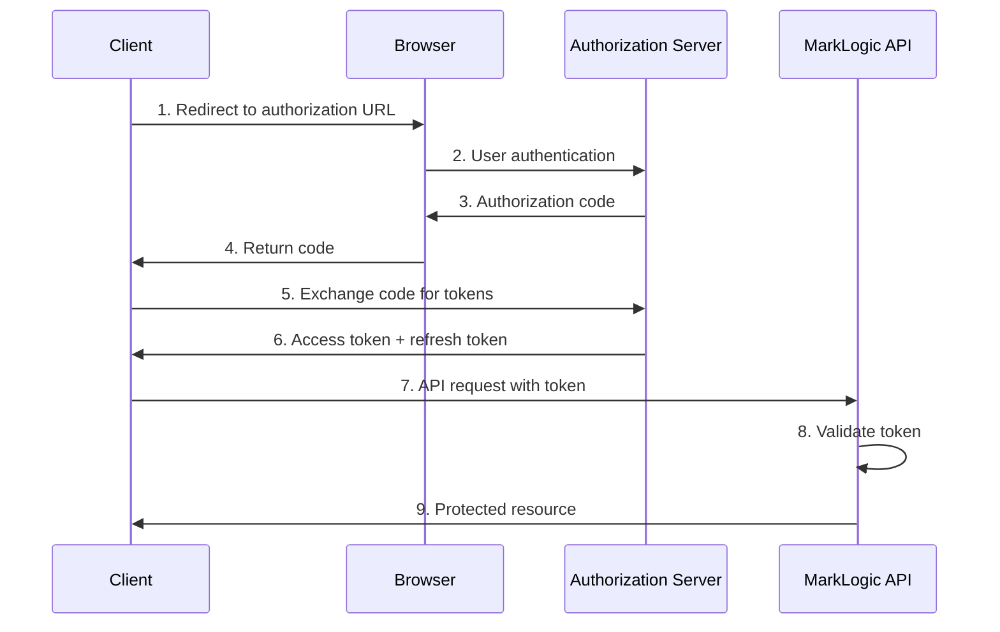
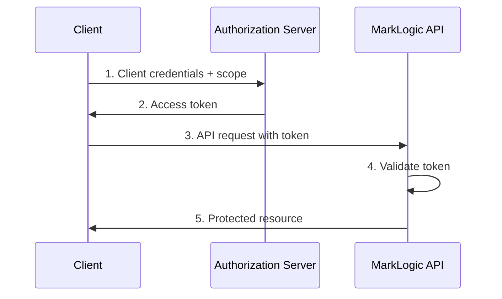

# 🔐 OAuth 2.0 Authentication Troubleshooting
## MarkLogic Authorization Server Integration and Diagnostics

[](#)
[](https://docs.marklogic.com/)
[](#)

> **Comprehensive OAuth 2.0 troubleshooting for MarkLogic API authentication**
>
> Master authorization server integration, JWT token validation, and modern API security

---

## 📋 Table of Contents

- [Introduction](#-introduction)
- [OAuth 2.0 Fundamentals](#-oauth-20-fundamentals)
- [MarkLogic OAuth Configuration](#-marklogic-oauth-configuration)
- [Authorization Server Setup](#-authorization-server-setup)
- [JWT Token Management](#-jwt-token-management)
- [Client Authentication](#-client-authentication)
- [Troubleshooting Tools](#-troubleshooting-tools)
- [Common Issues](#-common-issues)
- [API Security Best Practices](#-api-security-best-practices)
- [Performance and Scaling](#-performance-and-scaling)

---

## 🎯 Introduction

OAuth 2.0 provides secure, token-based authentication for MarkLogic REST APIs and applications. This guide covers comprehensive troubleshooting for OAuth 2.0 integration, JWT token validation, and modern API security patterns.

### 🔧 Why OAuth 2.0 Matters

OAuth 2.0 authentication provides:
- **API Security** - Token-based access control for REST endpoints
- **Scalable Authentication** - Stateless token validation
- **Modern Standards** - Industry-standard authorization framework
- **Mobile-Friendly** - Excellent support for mobile and SPA applications
- **Fine-Grained Access** - Scope-based authorization control

### 🎯 OAuth 2.0 vs Other Authentication Methods

| Feature | OAuth 2.0 | SAML 2.0 | LDAP | Basic Auth |
|---------|-----------|----------|------|------------|
| **API-First** | ✅ Native | ❌ No | ⚠️ Limited | ✅ Simple |
| **Mobile Support** | ✅ Excellent | ⚠️ Limited | ❌ No | ✅ Basic |
| **Stateless** | ✅ JWT Tokens | ❌ Sessions | ❌ Sessions | ❌ Sessions |
| **Fine-Grained** | ✅ Scopes | ⚠️ Attributes | ⚠️ Groups | ❌ No |
| **Modern Standards** | ✅ Yes | ⚠️ Legacy | ⚠️ Legacy | ❌ Basic |
| **Complexity** | 🟡 Medium | 🔶 High | 🟢 Low | 🟢 Simple |

---

## 📚 OAuth 2.0 Fundamentals

### 🏗️ **Core Components**

#### **Authorization Server**
Issues access tokens after successful authentication and authorization.

**Examples:**
- Auth0
- Azure Active Directory (Microsoft Identity Platform)
- Google Identity Platform
- AWS Cognito
- Okta
- Keycloak
- MLEAProxy (Development/Testing)

#### **Resource Server**
The API server that validates tokens and serves protected resources (MarkLogic).

**MarkLogic Acts As:**
- Resource Server validating OAuth tokens
- API provider for authenticated clients

#### **Client Applications**
Applications requesting access to protected resources.

**Client Types:**
- **Confidential Clients** - Can securely store credentials (server-side apps)
- **Public Clients** - Cannot securely store credentials (SPAs, mobile apps)

### 🔄 **OAuth 2.0 Authorization Flows**

#### **Authorization Code Flow (Client-to-Server)**


#### **Client Credentials Flow (Server-to-Server)**


### 📝 **Key OAuth 2.0 Concepts**

#### **Access Tokens**
Short-lived tokens for API access (typically JWT format).

**Characteristics:**
- **Lifetime**: 15 minutes to 1 hour
- **Format**: JWT (JSON Web Token)
- **Scope**: Limited permissions
- **Validation**: Signature verification

#### **Refresh Tokens**
Long-lived tokens for obtaining new access tokens.

**Characteristics:**
- **Lifetime**: Days to months
- **Purpose**: Token renewal without re-authentication
- **Security**: More sensitive, requires secure storage
- **Rotation**: Should be rotated on use

#### **Scopes**
Define the level of access granted to the client.

**Examples:**
- `read:documents` - Read access to documents
- `write:documents` - Create/update documents
- `admin:users` - User management operations
- `search:collections` - Search specific collections

---

## 🏗️ MarkLogic OAuth Configuration

### 📋 **External Security Configuration**

#### **Basic OAuth Setup**
```bash
curl -X POST --anyauth -u admin:admin \
  -H "Content-Type:application/json" \
  -d '{
    "external-security-name": "OAUTH2-test",
    "description": "OAuth2 test configuration",
    "authentication": "oauth",
    "cache-timeout": 300,
    "authorization": "oauth",
    "oauth-server": {
      "oauth-vendor": "Other",
      "oauth-flow-type": "Resource server",
      "oauth-client-id": "marklogic",
      "oauth-jwt-issuer-uri": "https://your-oauth-provider.com",
      "oauth-token-type": "JSON Web Tokens",
      "oauth-username-attribute": "preferred_username",
      "oauth-role-attribute": "marklogic-roles",
      "oauth-privilege-attribute": "",
      "oauth-jwt-alg": "RS256",
      "oauth-jwks-uri": "https://your-oauth-provider.com/jwks"
    }
  }' \
  "http://oauth.warnesnet.com:8002/manage/v2/external-security"
```

If you are using JWT Secrets these need to be added seperately

```bash
curl -X POST --anyauth -u admin:admin \
  -H "Content-Type:application/json" \
  -d '{
    "oauth-server": {
      "oauth-jwt-secret": [
        {
          "oauth-jwt-key-id": "DCYjkxqf7xLskUc_9tlaJ8-2QC4Vx-G1nPC1qPQro1Q",
          "oauth-jwt-secret-value": "-----BEGIN PUBLIC KEY-----\n[YOUR_PEM_KEY_HERE]\n-----END PUBLIC KEY-----"
        },
        {
          "oauth-jwt-key-id": "GPbsBv5V6BvCQ0QPLeC_10hzdLSuc2FRow-L0j3JE5Y",
          "oauth-jwt-secret-value": "-----BEGIN PUBLIC KEY-----\n[YOUR_PEM_KEY_HERE]\n-----END PUBLIC KEY-----"
        }
      ]
    }
  }' \
  "http://oauth.warnesnet.com:8002/manage/v2/external-security/OAUTH2-test/jwt-secrets"

```

#### **OAuth External Security Options**

| Parameter | Description | Example | Notes |
|-----------|-------------|---------|-------|
| **external-security-name** | Name of the external security configuration | `"OAUTH2-test"` | Unique identifier for the config |
| **description** | Description of the configuration | `"OAuth2 test configuration"` | Optional descriptive text |
| **authentication** | Authentication method | `"oauth"` | Required for OAuth |
| **authorization** | Authorization source | `"oauth"` | Controls role assignment |
| **cache-timeout** | Token cache duration (seconds) | `300` | Default: 300 seconds |
| **oauth-vendor** | OAuth vendor type | `"Other", "Microsoft Entra", "Amazon Cognito"` | Vendor-specific settings |
| **oauth-flow-type** | OAuth flow type | `"Resource server"` | Defines MarkLogic's role |
| **oauth-client-id** | OAuth client identifier | `"marklogic"` | Client ID for this resource server |
| **oauth-jwt-issuer-uri** | Token issuer URL | `"https://your-oauth-provider.com"` | Must match token iss claim |
| **oauth-token-type** | Token format type | `"JSON Web Tokens"` | Specifies JWT token format |
| **oauth-username-attribute** | Username claim in JWT | `"preferred_username"` | Maps JWT claim to username |
| **oauth-role-attribute** | Role claim in JWT | `"marklogic-roles"` | Maps JWT claim to MarkLogic roles |
| **oauth-privilege-attribute** | Privilege claim in JWT | `""` | Maps JWT claim to privileges (optional) |
| **oauth-jwt-alg** | JWT signing algorithm | `"RS256"` | Algorithm for signature validation |
| **oauth-jwks-uri** | JWKS endpoint URL | `"https://your-oauth-provider.com/jwks"` | Public key endpoint for validation |
| **oauth-jwt-secret** | JWT signing secrets | Array of key objects | Used for manual key management |
| **oauth-jwt-key-id** | Key identifier | `"DCYjkxqf7xLskUc_9tlaJ8-2QC4Vx-G1nPC1qPQro1Q"` | Identifies specific signing key |
| **oauth-jwt-secret-value** | Public key PEM | `"-----BEGIN PUBLIC KEY-----..."` | PEM-formatted public key |

---

## 🏢 Authorization Server Setup

### 🔧 **Generic Authorization Server Configuration**

#### **Required Authorization Server Settings**
| Setting | Value | Description |
|---------|-------|-------------|
| **Issuer URL** | `https://auth.example.com` | Token issuer identifier |
| **Token Endpoint** | `https://auth.example.com/oauth/token` | Token generation endpoint |
| **JWKS URI** | `https://auth.example.com/.well-known/jwks.json` | Public key endpoint |
| **Supported Scopes** | `read:api`, `write:documents` | Available permission scopes |
| **Token Lifetime** | 3600 seconds (1 hour) | Access token validity period |

#### **Client Registration**
Configure MarkLogic API as a resource server:

```json
{
  "client_id": "marklogic-api-client",
  "client_name": "MarkLogic API Client",
  "client_secret": "secure-client-secret",
  "grant_types": ["authorization_code", "client_credentials"],
  "redirect_uris": ["https://marklogic.example.com:8443/oauth/callback"],
  "scope": "read:api write:documents admin:users",
  "token_endpoint_auth_method": "client_secret_basic"
}
```

### ☁️ **Azure Active Directory Configuration**

#### **App Registration Setup**
1. **Create App Registration**
   - Azure Portal → Azure Active Directory → App registrations
   - New registration → "MarkLogic API"

2. **Configure Authentication**
   ```
   Platform: Web
   Redirect URIs: https://marklogic.example.com:8443/oauth/callback
   Implicit flow: Access tokens (for SPA clients)
   ```

3. **API Permissions**
   ```
   Microsoft Graph: User.Read (delegated)
   Custom Scopes: Define application-specific permissions
   ```

4. **Expose an API**
   ```
   Application ID URI: api://marklogic-api
   Scopes:
   - api://marklogic-api/Documents.Read
   - api://marklogic-api/Documents.Write
   - api://marklogic-api/Admin.Users
   ```

#### **Azure AD Token Configuration**
```json
{
  "issuer": "https://login.microsoftonline.com/{tenant-id}/v2.0",
  "authorization_endpoint": "https://login.microsoftonline.com/{tenant-id}/oauth2/v2.0/authorize",
  "token_endpoint": "https://login.microsoftonline.com/{tenant-id}/oauth2/v2.0/token",
  "jwks_uri": "https://login.microsoftonline.com/{tenant-id}/discovery/v2.0/keys",
  "scopes_supported": ["api://marklogic-api/Documents.Read", "api://marklogic-api/Documents.Write"]
}
```

### 🔧 **Auth0 Configuration**

#### **Application Setup**
```json
{
  "name": "MarkLogic API",
  "description": "MarkLogic REST API Application",
  "app_type": "regular_web",
  "callbacks": ["https://marklogic.example.com:8443/oauth/callback"],
  "allowed_origins": ["https://marklogic.example.com:8443"],
  "jwt_configuration": {
    "lifetime_in_seconds": 3600,
    "alg": "RS256"
  },
  "grant_types": ["authorization_code", "client_credentials"]
}
```

#### **API Configuration**
```json
{
  "name": "MarkLogic API",
  "identifier": "https://api.marklogic.example.com/",
  "scopes": [
    {
      "value": "read:documents",
      "description": "Read access to documents"
    },
    {
      "value": "write:documents", 
      "description": "Create and update documents"
    },
    {
      "value": "admin:users",
      "description": "User management operations"
    }
  ],
  "signing_alg": "RS256",
  "token_lifetime": 3600
}
```

### 🏠 **MLEAProxy OAuth Server (Development)**

For development and testing, MLEAProxy provides OAuth 2.0 capabilities:

#### **MLEAProxy OAuth Configuration**
```properties
# OAuth token validity (1 hour)
oauth.token.validity=3600

# Default roles for users
oauth.default.roles=user

# OAuth private key for JWT signing
oauth.keypath=classpath:static/certificates/privkey.pem
```

#### **MLEAProxy OAuth Endpoints**
- **Token Endpoint**: `http://localhost:8080/oauth/token`
- **JWKS Endpoint**: `http://localhost:8080/oauth/jwks`
- **Discovery**: `http://localhost:8080/oauth/.well-known/openid_configuration`

#### **Token Generation Example**
```bash
# Client credentials flow with MLEAProxy
curl -X POST http://localhost:8080/oauth/token \
  -H "Content-Type: application/x-www-form-urlencoded" \
  -d "grant_type=client_credentials&client_id=test-client&client_secret=test-secret&scope=read:documents"
```

---

## 🎫 JWT Token Management

### 📋 **JWT Token Structure**

#### **JWT Header**
```json
{
  "alg": "RS256",
  "typ": "JWT",
  "kid": "oauth-signing-key-id"
}
```

#### **JWT Payload (Claims)**
```json
{
  "iss": "https://auth.example.com",
  "sub": "user123",
  "aud": "marklogic-api",
  "exp": 1698765432,
  "iat": 1698761832,
  "scope": "read:documents write:documents",
  "email": "user@example.com",
  "name": "John Doe",
  "roles": ["user", "editor"]
}
```

### 🔍 **Token Validation Process**

#### **MarkLogic Token Validation Steps**
1. **Extract Token** - From Authorization header
2. **Verify Signature** - Using public key from certificate
3. **Validate Claims** - Check issuer, audience, expiration
4. **Cache Result** - Store validation result for performance
5. **Map User** - Create user session from token claims

#### **Token Validation XQuery**
```xquery
(: Manual JWT token validation for debugging :)
declare namespace jwt = "http://marklogic.com/xdmp/jwt";

let $token := "eyJhbGciOiJSUzI1NiIsInR5cCI6IkpXVCJ9..."
let $signing-cert := pki:get-trusted-certificate("oauth-signing-cert")

try {
  let $claims := jwt:verify($token, $signing-cert)
  return (
    "Token Valid: true",
    "Subject: " || map:get($claims, "sub"),
    "Issuer: " || map:get($claims, "iss"),
    "Audience: " || map:get($claims, "aud"),
    "Expires: " || xdmp:timestamp-to-wallclock(map:get($claims, "exp") * 1000),
    "Scopes: " || map:get($claims, "scope")
  )
} catch($e) {
  "Token Invalid: " || $e/error:message/text()
}
```

### 🔄 **Token Refresh Handling**

#### **Refresh Token Flow**
```bash
# Exchange refresh token for new access token
curl -X POST https://auth.example.com/oauth/token \
  -H "Content-Type: application/x-www-form-urlencoded" \
  -d "grant_type=refresh_token&refresh_token=REFRESH_TOKEN&client_id=CLIENT_ID&client_secret=CLIENT_SECRET"
```

#### **Automatic Token Refresh (JavaScript)**
```javascript
class TokenManager {
  constructor(clientId, clientSecret, refreshToken) {
    this.clientId = clientId;
    this.clientSecret = clientSecret;
    this.refreshToken = refreshToken;
    this.accessToken = null;
    this.expiresAt = null;
  }

  async getValidToken() {
    if (!this.accessToken || Date.now() >= this.expiresAt - 30000) {
      await this.refreshAccessToken();
    }
    return this.accessToken;
  }

  async refreshAccessToken() {
    const response = await fetch('https://auth.example.com/oauth/token', {
      method: 'POST',
      headers: {
        'Content-Type': 'application/x-www-form-urlencoded',
        'Authorization': `Basic ${btoa(this.clientId + ':' + this.clientSecret)}`
      },
      body: new URLSearchParams({
        grant_type: 'refresh_token',
        refresh_token: this.refreshToken
      })
    });

    const data = await response.json();
    this.accessToken = data.access_token;
    this.expiresAt = Date.now() + (data.expires_in * 1000);
    
    if (data.refresh_token) {
      this.refreshToken = data.refresh_token;
    }
  }
}
```

---

## 👤 Client Authentication

### 🔐 **Client Authentication Methods**

#### **Client Secret Basic**
```bash
# Authorization header with base64-encoded client credentials
curl -X POST https://auth.example.com/oauth/token \
  -H "Authorization: Basic $(echo -n 'client_id:client_secret' | base64)" \
  -H "Content-Type: application/x-www-form-urlencoded" \
  -d "grant_type=client_credentials&scope=read:documents"
```

#### **Client Secret Post**
```bash
# Client credentials in request body
curl -X POST https://auth.example.com/oauth/token \
  -H "Content-Type: application/x-www-form-urlencoded" \
  -d "grant_type=client_credentials&client_id=CLIENT_ID&client_secret=CLIENT_SECRET&scope=read:documents"
```

#### **Private Key JWT**
```bash
# Client assertion using JWT signed with private key
curl -X POST https://auth.example.com/oauth/token \
  -H "Content-Type: application/x-www-form-urlencoded" \
  -d "grant_type=client_credentials&client_assertion_type=urn:ietf:params:oauth:client-assertion-type:jwt-bearer&client_assertion=JWT_TOKEN&scope=read:documents"
```

### 📱 **PKCE (Proof Key for Code Exchange)**

#### **PKCE Flow for Public Clients**
```javascript
// Generate PKCE parameters
function generatePKCE() {
  const codeVerifier = base64URLEncode(crypto.getRandomValues(new Uint8Array(32)));
  const codeChallenge = base64URLEncode(
    new Uint8Array(await crypto.subtle.digest('SHA-256', new TextEncoder().encode(codeVerifier)))
  );
  
  return {
    codeVerifier,
    codeChallenge,
    codeChallengeMethod: 'S256'
  };
}

// Authorization request with PKCE
const { codeVerifier, codeChallenge } = generatePKCE();
const authUrl = `https://auth.example.com/oauth/authorize?` +
  `response_type=code&client_id=CLIENT_ID&redirect_uri=REDIRECT_URI&` +
  `scope=read:documents&code_challenge=${codeChallenge}&code_challenge_method=S256`;

// Token exchange with PKCE
const tokenResponse = await fetch('https://auth.example.com/oauth/token', {
  method: 'POST',
  headers: { 'Content-Type': 'application/x-www-form-urlencoded' },
  body: new URLSearchParams({
    grant_type: 'authorization_code',
    client_id: 'CLIENT_ID',
    code: 'AUTHORIZATION_CODE',
    redirect_uri: 'REDIRECT_URI',
    code_verifier: codeVerifier
  })
});
```

---

## 🔧 Troubleshooting Tools

### 🛠️ **Essential OAuth Tools**

| Tool | Platform | Purpose | Skill Level |
|------|----------|---------|-------------|
| **JWT.io** | Web | JWT token decoding and validation | Beginner |
| **OAuth Debugger** | Web | OAuth flow testing and debugging | Beginner |
| **Postman** | Cross-platform | API testing with OAuth flows | Intermediate |
| **Wireshark** | Cross-platform | Network analysis ([Guide](../NETWORK_TROUBLESHOOTING.md)) | Advanced |
| **curl** | Command-line | Direct API testing | Intermediate |
| **jq** | Command-line | JSON processing and analysis | Intermediate |

### 🔍 **JWT Token Analysis**

#### **Decode JWT Tokens**
```bash
# Decode JWT header and payload (without verification)
jwt_decode() {
  local token=$1
  local header=$(echo $token | cut -d. -f1 | base64 -d 2>/dev/null)
  local payload=$(echo $token | cut -d. -f2 | base64 -d 2>/dev/null)
  
  echo "Header:"
  echo $header | jq .
  echo -e "\nPayload:"
  echo $payload | jq .
}

# Usage
jwt_decode "eyJhbGciOiJSUzI1NiIsInR5cCI6IkpXVCJ9..."
```

#### **Verify JWT Signature**
```bash
# Extract public key from JWKS endpoint
curl -s https://auth.example.com/.well-known/jwks.json | jq '.keys[0]'

# Verify token signature using public key
# Note: Requires jwt-cli or similar tool
jwt verify TOKEN --key PUBLIC_KEY --alg RS256
```

### 📊 **OAuth Flow Testing**

#### **Authorization Code Flow Test**
```bash
#!/bin/bash
# OAuth Authorization Code Flow Test

CLIENT_ID="your-client-id"
CLIENT_SECRET="your-client-secret"
REDIRECT_URI="https://marklogic.example.com:8443/oauth/callback"
AUTH_SERVER="https://auth.example.com"

# Step 1: Generate authorization URL
AUTH_URL="${AUTH_SERVER}/oauth/authorize?response_type=code&client_id=${CLIENT_ID}&redirect_uri=${REDIRECT_URI}&scope=read:documents"

echo "1. Open this URL in browser:"
echo $AUTH_URL
echo ""

# Step 2: Exchange authorization code for token
read -p "Enter authorization code from redirect: " AUTH_CODE

TOKEN_RESPONSE=$(curl -s -X POST ${AUTH_SERVER}/oauth/token \
  -H "Content-Type: application/x-www-form-urlencoded" \
  -d "grant_type=authorization_code&client_id=${CLIENT_ID}&client_secret=${CLIENT_SECRET}&code=${AUTH_CODE}&redirect_uri=${REDIRECT_URI}")

echo "2. Token Response:"
echo $TOKEN_RESPONSE | jq .

# Step 3: Test API access
ACCESS_TOKEN=$(echo $TOKEN_RESPONSE | jq -r .access_token)
echo ""
echo "3. Testing API access:"
curl -H "Authorization: Bearer $ACCESS_TOKEN" https://marklogic.example.com:8443/v1/documents
```

#### **Client Credentials Flow Test**
```bash
# Test client credentials flow
test_client_credentials() {
  local client_id=$1
  local client_secret=$2
  local auth_server=$3
  local scope=${4:-"read:documents"}
  
  echo "Testing Client Credentials Flow..."
  
  local response=$(curl -s -X POST ${auth_server}/oauth/token \
    -H "Content-Type: application/x-www-form-urlencoded" \
    -d "grant_type=client_credentials&client_id=${client_id}&client_secret=${client_secret}&scope=${scope}")
  
  echo "Token Response:"
  echo $response | jq .
  
  local access_token=$(echo $response | jq -r .access_token)
  if [ "$access_token" != "null" ]; then
    echo -e "\n✅ Token obtained successfully"
    echo "Testing API access..."
    curl -H "Authorization: Bearer $access_token" https://marklogic.example.com:8443/v1/documents
  else
    echo "❌ Failed to obtain token"
  fi
}

# Usage
test_client_credentials "client-id" "client-secret" "https://auth.example.com"
```

### 🖥️ **MarkLogic OAuth Debugging**

#### **Enable OAuth Logging**
```xquery
(: Enable detailed OAuth logging :)
import module namespace admin = "http://marklogic.com/xdmp/admin" 
  at "/MarkLogic/admin.xqy";

let $config := admin:get-configuration()
let $appserver-id := admin:appserver-get-id($config, 
  admin:group-get-id($config, "Default"), "api-server")

(: Enable debug logging for OAuth :)
let $config := admin:appserver-set-debug-allow($config, $appserver-id, fn:true())
let $config := admin:group-set-audit-enabled($config, 
  admin:group-get-id($config, "Default"), fn:true())

return admin:save-configuration($config)
```

#### **OAuth Configuration Validation**
```xquery
(: Validate OAuth external security configuration :)
import module namespace sec = "http://marklogic.com/xdmp/security" 
  at "/MarkLogic/security.xqy";

for $ext-sec in sec:get-external-securities()
where sec:external-security-get-authentication($ext-sec) = "oauth2"
return (
  "Name: " || sec:external-security-get-external-security-name($ext-sec),
  "Authentication: " || sec:external-security-get-authentication($ext-sec),
  "Authorization: " || sec:external-security-get-authorization($ext-sec),
  "Cache Timeout: " || sec:external-security-get-cache-timeout($ext-sec),
  "OAuth Issuer: " || sec:external-security-get-oauth-issuer($ext-sec),
  "OAuth Audience: " || sec:external-security-get-oauth-audience($ext-sec),
  "---"
)
```

---

## ❌ Common Issues

### 🚨 **Token Validation Failures**

#### **"Invalid signature" Error**

**Symptoms:**
- API returns 401 Unauthorized
- Token signature verification fails

**Root Causes:**
1. **Wrong signing certificate** - Certificate mismatch with auth server
2. **Key rotation** - Auth server rotated signing keys
3. **Algorithm mismatch** - Different signing algorithm expected

**Troubleshooting Steps:**
```bash
# 1. Check current JWKS from auth server
curl -s https://auth.example.com/.well-known/jwks.json | jq .

# 2. Decode token to check algorithm and key ID
jwt_decode $ACCESS_TOKEN

# 3. Verify certificate matches JWKS
openssl x509 -in current-cert.pem -text -noout | grep "Public-Key"
```

**Solution:**
```xquery
(: Update OAuth signing certificate :)
import module namespace pki = "http://marklogic.com/xdmp/pki" 
  at "/MarkLogic/pki.xqy";

(: Remove old certificate :)
pki:delete-trusted-certificate("oauth-signing-cert"),

(: Import new certificate from JWKS :)
pki:insert-trusted-certificates(
  pki:certificate-template(
    "oauth-signing-cert-updated",
    "Updated OAuth Signing Certificate",
    $new-cert-pem
  )
)
```

#### **"Token expired" Error**

**Symptoms:**
- API calls fail with 401 after some time
- Token exp claim is in the past

**Root Causes:**
1. **Clock skew** - Time difference between systems
2. **Long-running processes** - Token expires during execution
3. **No refresh mechanism** - Client not refreshing tokens

**Diagnosis:**
```bash
# Check token expiration
ACCESS_TOKEN="your-token-here"
PAYLOAD=$(echo $ACCESS_TOKEN | cut -d. -f2 | base64 -d)
EXP=$(echo $PAYLOAD | jq .exp)
CURRENT=$(date +%s)

if [ $CURRENT -gt $EXP ]; then
  echo "Token expired $(($CURRENT - $EXP)) seconds ago"
else
  echo "Token valid for $(($EXP - $CURRENT)) more seconds"
fi
```

**Solution:**
1. **Implement token refresh** in client applications
2. **Synchronize clocks** using NTP
3. **Increase token lifetime** at authorization server (if appropriate)

### 🔐 **Client Authentication Issues**

#### **"Invalid client" Error**

**Symptoms:**
- Token endpoint returns 401 or 400
- Client authentication fails

**Root Causes:**
1. **Wrong client credentials** - ID or secret mismatch
2. **Client not registered** - Client not configured at auth server
3. **Authentication method mismatch** - Wrong auth method used

**Troubleshooting:**
```bash
# Test client credentials
curl -v -X POST https://auth.example.com/oauth/token \
  -H "Authorization: Basic $(echo -n 'client_id:client_secret' | base64)" \
  -H "Content-Type: application/x-www-form-urlencoded" \
  -d "grant_type=client_credentials&scope=read:documents"

# Check response for specific error
# invalid_client = wrong credentials
# unsupported_grant_type = configuration issue
```

#### **"Unauthorized redirect URI" Error**

**Symptoms:**
- Authorization fails during redirect
- OAuth flow breaks at callback

**Solution:**
1. **Verify redirect URI** is registered at auth server
2. **Check exact match** including protocol and port
3. **Update client configuration** with correct URIs

### ⏰ **Scope and Permission Issues**

#### **"Insufficient scope" Error**

**Symptoms:**
- API returns 403 Forbidden
- Token has valid signature but wrong permissions

**Root Causes:**
1. **Missing scopes** - Client didn't request required scope
2. **Scope mapping** - Auth server not including required scopes
3. **MarkLogic configuration** - Required scopes not configured

**Diagnosis:**
```bash
# Check token scopes
ACCESS_TOKEN="your-token-here"
echo $ACCESS_TOKEN | cut -d. -f2 | base64 -d | jq .scope
```

**Solution:**
```xquery
(: Update required scopes in MarkLogic :)
let $config := admin:get-configuration()
let $appserver-id := admin:appserver-get-id($config, 
  admin:group-get-id($config, "Default"), "api-server")

let $config := admin:appserver-set-oauth-required-scopes($config, 
  $appserver-id, ("read:documents", "write:documents"))

return admin:save-configuration($config)
```

---

## 🔒 API Security Best Practices

### 🛡️ **Token Security**

#### **Secure Token Storage**
```javascript
// ✅ Good: Secure token storage
class SecureTokenStorage {
  constructor() {
    this.tokenKey = 'oauth_access_token';
    this.refreshKey = 'oauth_refresh_token';
  }

  // Store in secure HTTP-only cookie or secure storage
  storeTokens(accessToken, refreshToken) {
    // Use secure, HTTP-only cookie for web apps
    document.cookie = `${this.tokenKey}=${accessToken}; Secure; HttpOnly; SameSite=Strict`;
    
    // Or use secure local storage with encryption
    const encrypted = this.encrypt(JSON.stringify({
      access_token: accessToken,
      refresh_token: refreshToken,
      timestamp: Date.now()
    }));
    
    localStorage.setItem('oauth_tokens', encrypted);
  }

  // ❌ Bad: Insecure storage
  // localStorage.setItem('access_token', token); // Vulnerable to XSS
}
```

#### **Token Transmission Security**
```bash
# ✅ Always use HTTPS for token requests
curl -X POST https://auth.example.com/oauth/token \
  -H "Content-Type: application/x-www-form-urlencoded" \
  -d "grant_type=client_credentials&client_id=CLIENT_ID&client_secret=CLIENT_SECRET"

# ❌ Never use HTTP for sensitive operations
# curl -X POST http://auth.example.com/oauth/token  # INSECURE!
```

### 🔐 **Scope-Based Authorization**

#### **Implement Fine-Grained Scopes**
```xquery
(: Role-based scope validation :)
declare function local:check-scope($required-scope as xs:string) as xs:boolean {
  let $current-user := xdmp:get-current-user()
  let $token-scopes := xdmp:get-request-header("X-OAuth-Scopes")
  let $user-scopes := fn:tokenize($token-scopes, " ")
  
  return $required-scope = $user-scopes
};

(: Protect document operations with scopes :)
if (local:check-scope("write:documents")) then
  (: Allow document creation/update :)
  xdmp:document-insert("/documents/new-doc.json", $document-content)
else
  (: Return insufficient permissions error :)
  fn:error(xs:QName("INSUFFICIENT-SCOPE"), "write:documents scope required")
```

#### **Scope Mapping Configuration**
```json
{
  "scopes": {
    "read:documents": {
      "description": "Read access to documents",
      "operations": ["GET /v1/documents", "GET /v1/search"],
      "collections": ["public", "shared"]
    },
    "write:documents": {
      "description": "Create and update documents", 
      "operations": ["POST /v1/documents", "PUT /v1/documents"],
      "collections": ["public", "shared", "private"]
    },
    "admin:users": {
      "description": "User management operations",
      "operations": ["GET /manage/v2/users", "POST /manage/v2/users"],
      "roles": ["admin"]
    }
  }
}
```

### 🔍 **Security Monitoring**

#### **OAuth Audit Logging**
```xquery
(: Comprehensive OAuth audit logging :)
import module namespace sec = "http://marklogic.com/xdmp/security" 
  at "/MarkLogic/security.xqy";

(: Log OAuth authentication events :)
declare function local:log-oauth-event($event-type, $client-id, $scopes, $result) {
  let $log-entry := map:new((
    map:entry("timestamp", fn:current-dateTime()),
    map:entry("event_type", $event-type),
    map:entry("client_id", $client-id),
    map:entry("scopes", $scopes),
    map:entry("result", $result),
    map:entry("ip_address", xdmp:get-request-header("X-Forwarded-For")),
    map:entry("user_agent", xdmp:get-request-header("User-Agent"))
  ))
  return xdmp:log($log-entry, "info")
};

(: Usage in authentication handler :)
local:log-oauth-event("token_validation", $client-id, $token-scopes, "success")
```

#### **Rate Limiting and Throttling**
```xquery
(: Implement rate limiting for OAuth endpoints :)
declare function local:check-rate-limit($client-id as xs:string) as xs:boolean {
  let $cache-key := "rate_limit_" || $client-id
  let $current-count := (xdmp:get-server-field($cache-key), 0)[1]
  let $rate-limit := 100 (: requests per minute :)
  
  return if ($current-count < $rate-limit) then (
    xdmp:set-server-field($cache-key, $current-count + 1),
    fn:true()
  ) else fn:false()
};
```

---

## ⚡ Performance and Scaling

### 🚀 **Token Caching Optimization**

#### **Optimal Cache Configuration**
```xquery
(: Configure OAuth token cache for performance :)
import module namespace sec = "http://marklogic.com/xdmp/security" 
  at "/MarkLogic/security.xqy";

(: Balance security and performance :)
sec:external-security-set-cache-timeout("oauth-config", 600) (: 10 minutes :)
```

#### **Cache Strategy Guidelines**
| Token Lifetime | Cache Timeout | Rationale |
|----------------|---------------|-----------|
| **15 minutes** | 5 minutes | Refresh before token expiry |
| **1 hour** | 10 minutes | Balance performance and security |
| **4 hours** | 30 minutes | Long-lived tokens, frequent validation |
| **1 day** | 1 hour | Development/testing environments |

### 📈 **Connection Pool Optimization**

#### **HTTP Client Configuration**
```xquery
(: Optimize HTTP connections for OAuth validation :)
let $config := admin:get-configuration()
let $appserver-id := admin:appserver-get-id($config, 
  admin:group-get-id($config, "Default"), "api-server")

(: Configure connection settings :)
let $config := admin:appserver-set-concurrent-request-limit($config, 
  $appserver-id, 64)
let $config := admin:appserver-set-request-timeout($config, 
  $appserver-id, 30)

return admin:save-configuration($config)
```

### 📊 **Performance Monitoring**

#### **OAuth Performance Metrics**
```xquery
(: Monitor OAuth authentication performance :)
declare function local:measure-oauth-performance() {
  let $start-time := xdmp:elapsed-time()
  
  (: Simulate OAuth token validation :)
  let $external-security := sec:get-external-security("oauth-config")
  let $validation-time := xdmp:elapsed-time() - $start-time
  
  return map:new((
    map:entry("oauth_validation_time_ms", $validation-time div xs:dayTimeDuration("PT0.001S")),
    map:entry("cache_timeout", sec:external-security-get-cache-timeout($external-security)),
    map:entry("timestamp", fn:current-dateTime())
  ))
};

(: Log performance metrics :)
let $metrics := local:measure-oauth-performance()
return xdmp:log($metrics, "info")
```

#### **Load Testing OAuth Endpoints**
```bash
#!/bin/bash
# OAuth load testing script

CLIENT_ID="load-test-client"
CLIENT_SECRET="load-test-secret"
AUTH_SERVER="https://auth.example.com"
API_SERVER="https://marklogic.example.com:8443"

# Get access token
get_token() {
  curl -s -X POST ${AUTH_SERVER}/oauth/token \
    -H "Content-Type: application/x-www-form-urlencoded" \
    -d "grant_type=client_credentials&client_id=${CLIENT_ID}&client_secret=${CLIENT_SECRET}&scope=read:documents" \
    | jq -r .access_token
}

# Load test API with OAuth tokens
load_test() {
  local concurrent_users=$1
  local requests_per_user=$2
  
  echo "Starting load test: $concurrent_users users, $requests_per_user requests each"
  
  for i in $(seq 1 $concurrent_users); do
    {
      local token=$(get_token)
      for j in $(seq 1 $requests_per_user); do
        curl -s -H "Authorization: Bearer $token" \
          "${API_SERVER}/v1/documents" > /dev/null
      done
    } &
  done
  
  wait
  echo "Load test completed"
}

# Run load test
load_test 10 50  # 10 concurrent users, 50 requests each
```

---

## 📋 Summary

This comprehensive OAuth 2.0 troubleshooting guide provides everything needed to successfully implement and maintain OAuth authentication with MarkLogic APIs.

### 🎯 **Key Takeaways**

#### **OAuth Implementation**
- Configure MarkLogic as OAuth Resource Server
- Set up Authorization Server with proper client registration
- Import and manage JWT signing certificates
- Implement secure token validation and caching

#### **Modern API Security**
- Use JWT tokens for stateless authentication
- Implement fine-grained scope-based authorization
- Follow OAuth 2.0 security best practices
- Monitor and audit API access patterns

#### **Client Integration**
- Support multiple OAuth flows (Authorization Code, Client Credentials)
- Implement proper token refresh mechanisms  
- Use PKCE for public clients
- Handle errors gracefully with proper fallbacks

#### **Performance Excellence**
- Optimize token caching strategies
- Configure appropriate connection pooling
- Monitor authentication performance metrics
- Plan for scale with load testing

### 🔧 **Essential Tools Mastery**
- **JWT.io** for token analysis and debugging
- **Postman/curl** for OAuth flow testing
- **Wireshark** for network troubleshooting ([Usage Guide](../NETWORK_TROUBLESHOOTING.md))
- **OpenSSL** for certificate management ([Complete Guide](../TLS_CERTIFICATE_MANAGEMENT.md))

### 📊 **Production Readiness**
- Comprehensive error handling and logging
- Automated certificate rotation monitoring
- Performance testing and optimization
- Security hardening and compliance reporting

Mastering OAuth 2.0 authentication enables modern, scalable API security that meets contemporary application requirements while maintaining enterprise-grade security standards.